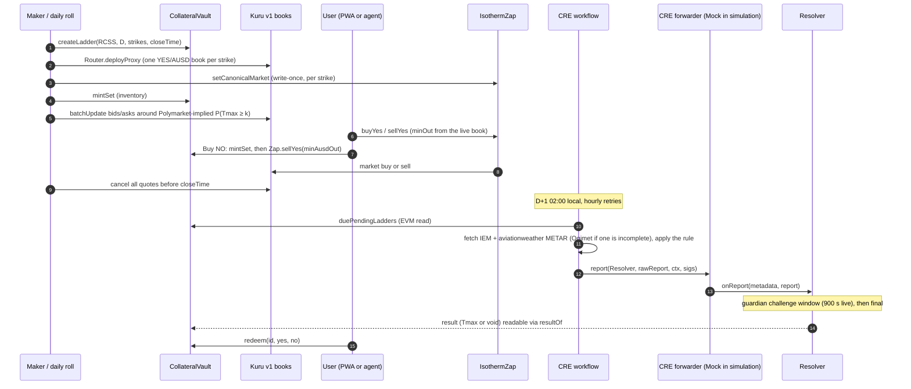

# Isotherm architecture

This document describes how Isotherm is put together: the contracts, the off-chain services, how a city-day moves from open to redemption, who holds which role, and how the system handles failures. It describes **v1 as deployed on Monad testnet on 2026-10-07** (`deployments/testnet.json`). Numbers come from the files they cite: the feasibility runs of 2026-10-06 (`spikes/*/RESULT.md`, `script/RESULT-v0-feasibility.md`, `test/security/RESULT.md`), the v1 contracts (`script/RESULT.md`), the v1 security review (`test/security/v1/RESULT.md`), the packages' own `RESULT.md` files and the go-live evidence (`docs/evidence/golive/`). Where the feasibility build differed, the section says so.

## 1. Scope

**Goals**
- One instrument, done carefully: "Tmax(station, local day) ≥ k °C", settled on an integer-°C METAR rule that reproduces how Polymarket's daily-high markets resolve.
- Fully collateralized at all times: every outstanding YES+NO pair is backed by exactly 1 AUSD in the vault.
- Every strike tradable on its own onchain order book (Kuru v1), usable by people (phone PWA), scripts and agents (MetaMask Agent Wallet plugin).
- Settlement by a Chainlink CRE workflow from two independent public archives, with void-at-par instead of guessing.

**Out of scope for the hackathon build**
- Real money: Isotherm runs on Monad testnet with faucet AUSD.
- Out-forecasting the market: the maker anchors to Polymarket-implied probabilities and keeps its own model as an independent guardrail (§6).
- Upgradeable contracts, governance, a token.

## 2. Components

| Folder | Runtime | Role |
|---|---|---|
| `src/` | Solidity 0.8.37, Monad testnet 10143 | Outcome tokens, ladders, collateral, settlement, forecast commitments |
| `deployments/testnet.json` | JSON | The single source of truth for addresses (written by the contracts deploy) |
| `packages/abi/` | JSON | ABIs exported from `forge` output, consumed by every TypeScript package |
| `packages/forecast/` | Node 22, zero-dependency TypeScript | METAR fetch and parse, the settlement rule (`settle-core`), Polymarket-implied ladders, the v0 guardrail model, recompute CLI |
| `packages/maker/` | Node 22 + viem; ran under launchd on an always-on host until the cutover, now the rollback path | Daily ladder roll, inventory, quoting, pull-at-close, kill switch (the shared core of both runtimes) |
| `apps/maker-worker/` | Cloudflare Worker + one SQLite-backed Durable Object | The live market maker since 2026-10-08 23:06 UTC: the same maker core on Cloudflare (tick, roll, kill switch, settlement watcher; from the 2026-10-09 release also treasury top-ups of the role keys) (§6) |
| `packages/cre-workflow/` | Chainlink CRE TypeScript SDK, compiled to WASM | Cron-triggered settlement |
| `packages/mm-plugin/` | oclif plugin for `@metamask/agent-wallet` 7.x | Agent commands: read ladders and quotes, trade through the Zap |
| `apps/web/` | Vite + React PWA on Cloudflare Pages (https://isotherm.pages.dev) | Phone app: ladder, trade, portfolio, redeem, results with an in-browser attestation check, risk card. Dynamic email login (Sandbox environment) is the default sign-in, with a labelled testnet burner wallet ("Dev wallet") as fallback (§9) |
| `apps/api/` | Cloudflare Worker + SQLite-backed Durable Object + KV, served at https://isotherm.pages.dev/api/* | Test-fund drip, gasless relay of signed AUSD authorizations, maker snapshot, stats from our own log scan |
| `spikes/` | mixed | Feasibility evidence from 2026-10-06; read-only |

Packages share code by relative import or plain JSON only (no npm workspaces).

**How API requests reach the Worker.** The web app (same origin), the maker and the MetaMask plugin all call `https://isotherm.pages.dev/api/*`. On the Pages project, the Pages Function `apps/web/functions/api/[[path]].ts` hands each request, unchanged, to the `isotherm-api` Worker over the service binding `API` declared in `apps/web/wrangler.toml`. The Worker has no public hostname: `workers_dev = false` and `preview_urls = false` in `apps/api/wrangler.toml`, and its once-a-minute cron trigger needs no route. CORS, bearer auth and the per-network rate limits all stay in the Worker. Cloudflare's edge sets `CF-Connecting-IP` on the Pages request and the binding passes it through, so those limits still key on the client's network (`apps/api/README.md`). `apps/web/public/_routes.json` runs a Function only for `/api/*` and for six retired bundle file names, which return 404; every other static asset is served without one. The Worker and the Pages project live on the same Cloudflare account, which the binding requires.

## 3. On-chain contracts

### 3.1 Identifiers

- `station`: ICAO code as ASCII `bytes4` (`"RCSS"` = `0x52435353`). Each station has a write-once UTC offset; the live deployment registers RCSS (+8 h) and RJTT (+9 h).
- `date`: the station-local calendar day as `uint32` yyyymmdd.
- `seriesId = keccak256(abi.encode(bytes4 station, uint32 date, int16 strikeC))`. One series is one strike.
- A **ladder** is all series for one (station, date). One CRE report settles the whole ladder.
- Token names look like `Isotherm RCSS 20261007 Tmax>=30C YES`, symbols like `RCSS-20261007-GE30-Y`.

### 3.2 Contracts

This table describes v1 as deployed on 2026-10-07 (`deployments/testnet.json`; Sourcify `exact_match` for Resolver, CollateralVault, IsothermZap and the OutcomeToken implementation). Addresses: Resolver `0x9c7876Bc27df6cB473f2eaFA296FdEC22747962B`, CollateralVault and StrikeFactory `0xae36cf0a163bAfCde4D40a6Ab7b5E3C762ad7B39`, IsothermZap `0x1ACaf47987Fe570df5d136Ae1CaC0D45E2B8CFb0`, OutcomeToken implementation `0x5EfaB33DDad0715b66f514Fe12d78Ca23f3e31fC`.

| Contract | Responsibility | Key functions |
|---|---|---|
| `OutcomeToken` | 6-decimal ERC-20 with EIP-2612 permit. One implementation; every YES and NO is an EIP-1167 clone with immutable args `(seriesId, station, date, strikeC, isYes)`. Only the vault can mint or burn. Permit domain: `{name:"Isotherm Outcome", version:"1", verifyingContract: clone}`, read it from `eip712Domain()` | ERC-20, `permit` |
| `StrikeFactory` (inherited by the vault) | Series registry. Operator-only creation. CREATE2 clones, so token addresses are predictable. Enforces `now < closeTime ≤ end of the station-local day` | `createLadder(station, date, int16[] strikes, closeTime)`, `createSeries`, `getSeries(id)`, `predictTokenAddress(station, date, k, isYes)` |
| `CollateralVault` | Complete sets backed 1:1 by AUSD, tracked per series with checked arithmetic; deposits are credited by balance delta. Pause stops new mints only. Optional per-series allowlist (the compliance hook for future gated series) | `mintSet`, `mintSetTo`, `mintSetWithPermit`, `mintSetWithAuthorization` (EIP-3009; the signed nonce binds series and amount via `mintAuthorizationNonce(seriesId, amount, salt)`), `redeemSet` (any time, never paused), `redeem(id, yes, no)` (once the result is final), `previewRedeem`, `payoutHalves`, `duePendingLadders(start, count)`, `setSeriesGated`, `setAllowlisted` |
| `Resolver` | Chainlink CRE `IReceiver`. Accepts a report only from the configured forwarder, only after the local day ends, only with an unexpired EIP-712 attestation (always required in v1), and only once per ladder. A settled result becomes final after a short guardian challenge window | `onReport(metadata, report)`, `challenge(station, date, reasonHash)` (guardian only), `voidIfStale(station, date)`, `resultOf`, `isFinal`, `staleAt`, `dayEnd`, `settlementDigest`, admin setters |
| `IsothermZap` | One-transaction trades on the series' **canonical** Kuru book (write-once per series, validated: base = series YES, quote = AUSD, price precision 1e4, size precision 1e6, taker fee ≤ 30 bps); trades only before the series' close; holds nothing between transactions | `setCanonicalMarket(seriesId, market)` (operator), `validateMarket`, `buyYes(seriesId, market, ausdIn, minYesOut, to)`, `sellYes(seriesId, market, yesIn, minAusdOut, to)`, `buyNo(seriesId, market, ausdIn, minAusdBack, to)` (clients use the two-step Buy NO in §5 instead) |
| `ForecastCommit` (written and tested for Monad mainnet 143) | Commit-reveal log of the day's probability ladder, committed before the local day starts and never overwritable | `commit(station, date, hash)`, `reveal(station, date, int16[] strikes, uint16[] probBps, salt)` |

Sizes in the feasibility build (runtime / initcode, bytes): CollateralVault 12,122 / 21,191; Resolver 11,034 / 12,127; OutcomeToken 7,140 / 8,245; ForecastCommit 6,252 / 6,525. All are under Ethereum's 24 KB limit as well as Monad's 128 KB.

### 3.3 Payout rule

After a ladder resolves with `tmax`:

| Result | YES pays | NO pays |
|---|---|---|
| Settled, `tmax ≥ k` | 1 AUSD | 0 |
| Settled, `tmax < k` | 0 | 1 AUSD |
| Void (sources disagree, no complete data, or stale) | 0.5 AUSD | 0.5 AUSD |

A settled result becomes redeemable at `finalAt = resolvedAt + challengeWindow` (a deploy-time constant, at most 2 days; **900 s on the live deployment**); during that window the guardian can only downgrade it to void. Void results are final at once. A full set always pays exactly 1. Void payouts round down; each call can lose at most 0.5 base unit (0.0000005 AUSD) as dust.

Invariants checked by the test suite (`VaultInvariant`: 5 invariants, 256 runs × 128 calls; `AdversarialInvariant`: 4 invariants over attack handlers): vault AUSD equals the sum of per-series collateral; the vault can always pay every outstanding claim; while unresolved, YES supply = NO supply = collateral for each series; deposits = holdings + payouts; results are write-once.

## 4. Lifecycle of one city-day



1. **Open (the day before, from 12:00 local).** The roll job (`packages/maker` `roll`) reads Polymarket's event for the city-day and picks consecutive strikes around the **Polymarket-implied median** (`pickStrikes()` in `packages/forecast`). The Mac's default picks 4–6 with the most uncertainty, trimming strikes whose implied probability is outside [0.03, 0.97]; from the 2026-10-09 release (`docs/OPERATIONS.md` §8.9) the Worker rolls at most 4, nearest the median, and skips any whose implied probability is outside [0.05, 0.95] (a near-certain strike costs a Kuru market, mints and margin for quotes that would be pulled). The RCSS 2026-10-08 ladder is ≥ 28/29/30/31 °C around a median of 29 °C (`docs/evidence/golive/roll-2026-10-08.json`); the 2026-10-09 ladder has five strikes, ≥ 28–32 °C. Strikes are per-ladder parameters, so no contract change is needed.
   `closeTime` (minting stops; the maker stops quoting 10 minutes earlier) comes from data, not a fixed offset: `packages/forecast` measured, over 2 years of complete days, when each station's daily maximum is first reached. For RCSS the maximum was reached by 12:00 on half of days, by 15:00 on 95% and by 17:30 on 99%, so the warm-season close is 17:30 local; after a 17:30 close the maximum still rose on 7 of 726 days (`packages/forecast/RESULT.md`). RJTT closes at 19:30 local on the same rule. Stations without the analysis fall back to 17:30 local.
2. **Quote.** See §6.
3. **Trade.** See §5.
4. **Close.** The maker cancels every quote before `closeTime`. Isotherm cannot halt a Kuru book (Kuru's Router owns it), and the day's maximum is usually public through METAR hours before settlement, so the maker pulls its own quotes before close. Users can still trade with each other on the book after close, merge pairs, or hold to settlement.
5. **Settle (D+1 02:00 local).** See §7.
6. **Redeem.** Once the result is final: right away for a void, after the challenge window (900 s on the live deployment) for a settled result. There is no optimistic-oracle proposal and dispute process.

## 5. Trading paths

Only YES has a book. NO is never listed.

| User intent | Path | Gas |
|---|---|---|
| Buy YES ≥ k | `Zap.buyYes`: market buy on the book, unspent AUSD refunded | 623,629 (0.0636 MON) in the feasibility live run; v1 on the live chain: 518,188 (go-live smoke test) |
| Buy NO ≥ k | `vault.mintSet(seriesId, n)` (n YES + n NO to the user), then `Zap.sellYes(n YES, minAusdOut)`. NO received is exactly n, and `sellYes` reverts if fewer than `minAusdOut` AUSD come back, so the worst-case NO price is fixed before signing. Net NO price = 1 − bid − fee. Used by the web app (`apps/web/src/lib/buyNo.ts`) and the plugin (`mm weather buy --side no`) | v1 `mintSet` 297,217 (fork e2e), plus `sellYes` |
| Sell YES | `Zap.sellYes`, unsold YES refunded | — |
| Sell NO | Plugin: `Zap.buyYes` sized from the L2 book for at least n YES, then `vault.redeemSet(n)`. The app offers merge or hold to settlement | — |
| Exit with a YES+NO pair | `vault.redeemSet`, never paused | 160,004 (v1 fork e2e) |
| After settlement | `vault.redeem` | 162,536 (0.0166 MON) |
| Direct book buy (no Zap) | approve the market, `placeAndExecuteMarketBuy` | 397,318 (0.0405 MON) |

The Zap exists because Kuru books are new contracts every day: one AUSD approval to the Zap replaces one approval per market per day (Buy NO also needs one AUSD approval to the vault and, for `sellYes`, a YES approval to the Zap). In v1 it trades only on the series' canonical book (registered once by an operator and validated through `Router.verifiedMarket`: base = the series' YES token, quote = AUSD, the precisions below, taker fee ≤ 30 bps), only before the series' close, pulls funds only from `msg.sender`, uses exact approvals reset to zero, a reentrancy guard and SafeCast, and requires a non-zero min-out on every path. The contract also exposes a one-call `Zap.buyNo`; clients use the two-step path above because its bound is exact.

**Kuru market parameters** (all v1 books): `type 0` (both legs ERC-20), `pricePrecision 1e4`, `tickSize 10` (a 0.001 tick, prices 0.001–0.999), `sizePrecision 1e6` (one size unit = one YES base unit), `minSize 1e6`, `maxSize 1e12`, `kuruAmmSpread 100` (backstop vault left empty), `takerFeeBps 10`, `makerFeeBps 0`; the 0.1% taker fee goes to Kuru's fee collector. The maker, Zap callers and UI keep prices ≤ 0.999.

## 6. Pricing and the market maker

**Fair value.** For each strike, fair value is the Polymarket-implied P(Tmax ≥ k): take the latest YES price of every bucket in Polymarket's event for that city-day, normalise the bucket prices to sum to 1 (the median raw sum is 1.04), and add up the buckets whose lower bound is ≥ k. The v0 model (Open-Meteo previous-runs, 7 models, rolling bias correction, inverse-MSE weighting, empirical residual spread) is used:
- as a guardrail: a strike is flagged when |model − Polymarket| > 0.15;
- as the primary quote only before Polymarket lists the day (it lists about 2 days ahead) or for a station Polymarket does not cover.

Why anchor to Polymarket: in a backtest over 381 station-days, Polymarket's prices at 23:00 the night before scored a pooled Brier of 0.0594 against 0.0656 for the v0 model (lead 1), and 0.0546 on the morning of the day (`spikes/weather/RESULT.md`). The maker therefore quotes around the market and conditions on the day's observations.

**Quoting policy** (`packages/maker`, `packages/maker/RESULT.md`):
- One post-only bid and one ask per strike around fair value: half-spread 3 ticks of 0.01 (Kuru's own tick is 0.001), prices rounded outward and kept in [0.01, 0.99], bid < fair < ask always. Inventory skew up to 2 ticks; position cap ±300 YES per strike. A strike is pulled when fair ≤ 0.03 or ≥ 0.97, and when the guardrail model differs from Polymarket by more than 0.40 (a gap above 0.15 doubles the spread).
- Size each quote from free margin plus what the cancelled orders release, so a re-quote after a fill never overdraws the Kuru margin account.
- Re-quote a strike only when it matters ("lazy maker", in the shared core from the 2026-10-09 release; the Mac runtime picks it up at its next runtime deploy): fair crossed a resting quote (urgent), a side filled (or less than half is left), fair moved at least 0.04 since the quote, or the quote is older than 2 hours and fair moved at least 0.02. Entering the guard's wide spread re-quotes; the desired price drifting by a few ticks does not. A fill is refilled on that side only (one Kuru `batchUpdate` without the other side: 55–66 % of a full re-quote's gas on a fork). Each full re-quote (cancel 2 + place 2) bills about 0.058 MON (`docs/evidence/golive/live-txs.tsv`). A replay of the Oct 8–10 ladders is in `apps/maker-worker/evidence/lazy-replay-2026-10-09/`.
- Daily MON budgets per role, metered per Taipei day (`packages/maker/config/`, `apps/maker-worker/config/worker.json`). Quoting has its own budget with tiers: above 60 % of it the spreads double and only urgent strikes are re-quoted; at the cap no new quotes go out and an urgent strike is pulled instead. The roll has its own meter. Pulls, the kill switch, the YES-margin withdraw and the stale void are on a separate reserve meter that never refuses (past its line they are only flagged and alerted).
- On day D the observed METAR maximum conditions fair value: once a report shows Tmax ≥ k, the strike is certain and is pulled.
- Pull every quote 10 minutes before `closeTime`, from the loop, a 15-second timer and a separate launchd watchdog every 5 minutes (it acts when the loop's heartbeat is over 3 minutes old). The kill switch cancels tracked order ids plus a scan of the last 300 ids, then withdraws the YES margin.
- Track order ids from `OrderCreated` events in receipts; the public RPC's `eth_getLogs` is limited to a 100-block range.
- The maker never sends a taker order, so it never trades against its own quotes. Maker fills are always reported separately from non-maker fills.

**The maker on Cloudflare** (`apps/maker-worker/README.md`). A cron trigger every minute re-arms one SQLite-backed Durable Object, `MakerDO`, which ticks on its own alarm: control, mode, kill switch, roll, order reconciliation, quoting, settlement watcher, treasury top-ups, snapshot. The trading logic is imported unchanged from `packages/maker` and `packages/forecast`, whose cores were split from their Node I/O (`packages/maker/test/core-purity.test.ts` checks the import graph). The Worker has no public surface and reaches the API over a service binding. It ran 6.5 hours in **shadow mode** (every decision computed through the shared dry-run path and compared with the Mac maker's snapshot, nothing signed) and has been **live since 2026-10-08 23:06 UTC** (the cutover, `docs/OPERATIONS.md` §8.3). Live takes two independent switches (a deploy-time variable and a Durable Object flag), and an interlock drops a tick back to shadow while another maker's snapshot is fresh, so two writers never share a key. Its roll has its own MON meter, separate from quoting. It reads Monad through several allowlisted public RPCs (each must answer chain 10143), with a per-endpoint request throttle, retries with backoff on rate limits and an ordered fallback, because the official RPC limits each client IP and Workers share egress IPs.

## 7. Settlement

### 7.1 Rule

```
Tmax(station, D) = max integer °C from the METAR "TT/DD" group (M = minus)
                   over all METAR and SPECI reports with obsTime in [D 00:00 local, D+1 00:00 local)
```

- Parse the temperature group with `\s(M?\d{2})\/(M?\d{2}|\/\/)?(?=\s)` on the text before ` RMK `. Never use aviationweather's JSON `temp` field, which can carry tenths from the T-group.
- Include SPECI and :30 reports, classify reports by observation minute (IEM's `report_type=4` bucket also contains routine :30 METARs), and use the local day.
- Fidelity against Polymarket: RCSS 183/184, RJTT 209/209 (`spikes/weather/RESULT.md`; the README has the table).

### 7.2 Sources

| Source | Request | Notes |
|---|---|---|
| A: IEM ASOS | `GET mesonet.agron.iastate.edu/cgi-bin/request/asos.py?station=RCSS&data=metar&…&tz=Asia/Taipei&report_type=3&report_type=4` | CSV, local time, end-exclusive. ~5 KB, 1.3–3.7 s. Lags aviationweather by 1–2 h. Had a multi-month RCSS gap (2025-09-17 → 2026-02-21), which is why two primary sources and a fallback are used |
| B: aviationweather.gov | `GET aviationweather.gov/api/data/metar?ids=RCSS&format=json&date=<local day end, UTC>&hours=24` | The window includes `date`, so drop `obsTime ≥ end`. Empty body = no data. Recent days only |
| C: Ogimet (fallback) | `GET ogimet.com/cgi-bin/getmetar?icao=RCSS&begin=…&end=…` (UTC, inclusive end) | Only when A or B is incomplete; it throttles |

**Completeness:** reports in at least 20 distinct local hours, and the last report at or after 23:00 local.

### 7.3 Decision

`packages/cre-workflow/settle/settle-core.ts` is byte-identical to `packages/forecast/src/settle-core.ts` (sha256 `119832de…3d62`, enforced by a test), and the workflow adds guards around its `decide()` without changing it (`packages/cre-workflow/RESULT.md` §1.2):

| Situation | Decision |
|---|---|
| A and B both complete and equal | SETTLED at that Tmax |
| A and B both complete but different | never settle; PENDING, then VOID after the deadline |
| A or B incomplete | fetch C (at most one Ogimet query per run); if two complete sources agree, SETTLED (2-of-3) |
| Otherwise | PENDING; retry hourly |
| Deadline | VOID only after D+1 00:00 local + 36 h **and** only if every consulted source answered with a genuine archive response, so a fetch failure never voids; a 46 h backstop voids regardless, still before the on-chain 48 h stale window |

The cron runs at 02:00 Taipei and 02:00 Tokyo (RCSS 18:00 UTC, RJTT 17:00 UTC) and hourly at :30, and nothing is attempted before D+1 00:00 local + 2 h. It pages `duePendingLadders` oldest first so a missed day is caught up, within the CRE quotas (15 HTTP calls, 15 EVM reads and 5 reports per run; the rest is deferred to the next run). Each signed report expires 25 minutes after the run's anchor time (`validUntil`).

Golden days built from real archive captures are part of the workflow's tests (`packages/cre-workflow/RESULT.md` §1.1); RCSS and RJTT for 2026-10-05 and 2026-10-06 settle at the highs Polymarket resolved.

### 7.4 Report and attestation

- Payload (v1): `abi.encode(bytes4 station, uint32 date, int16 tmaxC, bool isVoid, bytes32 sourcesHash, uint64 validUntil, bytes sig65)`.
- `sig65` is a low-s EIP-712 signature by the attester over `Settlement(bytes4 station,uint32 date,int16 tmaxC,bool isVoid,bytes32 sourcesHash,uint64 validUntil)` with domain `{name:"Isotherm Resolver", version:"1", chainId, verifyingContract: Resolver}`. A report is accepted only while `block.timestamp ≤ validUntil`, so a signed report whose delivery failed cannot be replayed later against a newer one. Reported Tmax must lie in [−90, 70] °C. `script/attestation-vector.json` is the v1 test vector, checked against the live Resolver's `settlementDigest` (`script/attestation-vector.sh`), and the workflow's signature is byte-identical to it.
- The forwarder's `rawReport` is a 109-byte header (`version | executionId | timestamp | donId | donConfigVersion | workflowId | workflowName | workflowOwner | reportId`) followed by the payload; the Resolver receives `metadata = rawReport[45:109]` and `report = rawReport[109:]`.
- Gas: an accepted whole-ladder report used 139k–156k gas through the simulator. The workflow sends a fixed 200,000 limit, so **each report transaction bills about 0.0204 MON** at 102 gwei, paid by the transaction sender (by default the attester's key; `packages/cre-workflow/RESULT.md`).
- **Both forwarders swallow a reverting `onReport`** and emit `ReportProcessed(result=false)` while the transaction succeeds. Success means `LadderResolved` was emitted or `resultOf` changed, never the transaction status.

### 7.5 Forwarder modes and who runs the workflow

| Mode | Forwarder | Who can call it | Authentication that matters |
|---|---|---|---|
| Simulation (`cre workflow simulate --broadcast`), used for the hackathon | `MockKeystoneForwarder` `0xB9F7…d192` | Anyone | The EIP-712 attestation. The mock passes fixed metadata (workflowId `0x11…11`, owner `0xaa…aa`, timestamp 100) |
| Production (with CRE deployment access) | `KeystoneForwarder` `0xF834…4482` | The DON's transmitter, with DON signatures | DON signatures + workflow-ID/owner pinning, plus the attestation |

Going to production is configuration, not a redeploy: `setForwarder(0xF834…4482)`, then `setExpectedWorkflow(id, owner)`. In v1 the attestation cannot be switched off, so the DON signatures and the attester key must both agree.

**During the hackathon** a scheduled job (`xyz.isotherm.cre-settle`, hourly at :05, launchd) runs the unmodified CRE CLI v1.37.0, byte-identical to the SHA-256-pinned release: `cre workflow simulate ./settle -T testnet --broadcast`. That is the CRE engine running the compiled WASM on one node and delivering through the MockKeystoneForwarder. If the CLI session is unavailable, the job falls back to the SDK test harness (the same handler and attestation under Bun), and each run writes an evidence record naming the path (`docs/OPERATIONS.md` §6). The same official CLI settled RCSS (25 °C) and RJTT (26 °C) for 2026-10-06 against the v1 Resolver on an anvil fork, and a second run skipped both as already resolved (`packages/cre-workflow/evidence/sim-fork.txt`). In the feasibility build, CRE reports through the MockKeystoneForwarder settled RCSS 2026-10-05 (29 °C) and 2026-10-04 (35 °C) on live testnet (`spikes/cre/RESULT.md`).

### 7.6 Stale void

`voidIfStale(station, date)` is open to anyone once `staleAt(station, date)` has passed with no result. In v1:
- `STALE_WINDOW = 48 h` after the local day ends, longer than the workflow's own 36 h void deadline, so a ladder the workflow is still waiting to settle cannot be voided by a third party.
- While the Resolver is paused, stale void is blocked, and after an unpause the workflow gets `RESUME_GRACE = 24 h` to deliver first.
- Liveness bound: from day end + 7 days anyone can void, paused or not, so collateral can never be locked forever.

## 8. Roles and keys

| Role | Can | Cannot |
|---|---|---|
| Owner | Register stations (offsets write-once), set forwarder, attester, guardian, expected workflow; set per-series allowlists; unpause | Move collateral; overwrite a final result; mint tokens; switch off attestation |
| Guardian | Pause new mints (vault) and `onReport` (resolver); during the challenge window, downgrade a settled result to void (`challenge`) | Change a result to a different temperature; block exits (`redeemSet` and `redeem` work while paused); keep a ladder unresolved past day end + 7 days |
| Attester | Sign settlements; as the workflow's default transaction sender it also pays about 0.0204 MON per report | Settle before the day ends or settle twice |
| Operator | Create series and ladders | Touch collateral |
| Maker | Quote with its own inventory | — |
| Relayer (`apps/api`) | Submit users' signed AUSD authorizations to two fixed vault functions, drip test funds | Move user funds without a valid user signature |
| Treasury (Worker secret `TREASURY_KEY`, optional) | Send testnet MON to the five role addresses listed in the Worker config, within per-role and global daily caps and a floor | Anything on the contracts (no role); it is refused if it equals the owner or any role key |

The guardian, attester, operator, maker and relayer each use a dedicated key, and the deploy script refuses to run if the guardian, attester or operator equals the deployer; the owner is the deployer key. Keys live outside the repository. The attester key is the trust anchor while CRE runs in simulation mode; around it sit attestations that expire (`validUntil`), the guardian's challenge window, a challenge watcher, and stale void as the no-report fallback. The guardian can turn a result into a refund but never into a different winner.

**Challenge watcher.** `xyz.isotherm.challenge-watch` runs every 120 s: it recomputes every `LadderResolved` with the settlement rule and, on a reproduced mismatch, challenges from the guardian key within the 900 s window. The Cloudflare maker carries a port of the same watcher.

Admins can never move collateral. The contracts never hold or send MON, so Monad's reserve-balance rule only affects EOAs: an account under 10 MON can send value only in an "emptying" transaction (no other transaction from it in the previous 3 blocks), which is why top-ups are spaced out.

## 9. Onboarding, wallets and gas

- **Login.** Dynamic email login (`apps/web/src/wallet/dynamic.tsx`, lazy-loaded: `DynamicContextProvider` with `EthereumWalletConnectors`; the sign-in button opens Dynamic's auth flow with `setShowAuthFlow`) is built around Dynamic's TSS-MPC embedded wallet. With smart wallets off, that wallet is a plain EOA, so its signatures verify with ecrecover. The app signs through `primaryWallet.getWalletClient('10143')`.
  - The Dynamic Sandbox environment uses email login, automatic embedded-wallet creation (EVM), smart wallets off, and Monad Testnet (10143) and Monad Mainnet (143) enabled. Its ID is a public value, kept in `apps/web/.env.production`. The app also injects 10143 and 143 through `overrides.evmNetworks` with `mergeNetworks`.
  - "Sign in with email" is the default on the live site; a labelled testnet burner wallet ("Dev wallet", key kept in the browser's localStorage) is the fallback.
  - **Live on Monad testnet.** A Dynamic embedded wallet, signed in on https://isotherm.pages.dev and funded from the deployer (0.25 MON, 10,000 faucet AUSD), signed an EIP-3009 `ReceiveWithAuthorization` that the relayer submitted as `mintSetWithAuthorization` (`0xca08d015…bf04`, block 68,971,790: 5 YES + 5 NO of RCSS 2026-10-08 ≥ 28 °C, no MON paid by the wallet). The wallet then sent its own AUSD approval (`0x99b2ad62…6e52`) and Zap `buyYes` (`0x361668d8…681c`, block 68,971,890: 5 AUSD → 5.045454 YES after Kuru's 0.1% taker fee). So the embedded wallet signs EIP-712 data and transactions on 10143, and AUSD accepts its signature (`apps/web/evidence/dynamic/RESULT.md`).
- **Gasless first deposit.** Dynamic's gas sponsorship does not list Monad (its supported-chain list excludes 143 and 10143, and the 7702 delegate it uses has no code on either chain), so Isotherm relays:
  - the user signs an EIP-3009 `receiveWithAuthorization` for AUSD (domain `"Agora Dollar"` v1, chainId 10143; `name()` returns `"AUSD"`, which is not the signing name), whose nonce the vault recomputes as `keccak256(abi.encode(seriesId, amount, salt))`, so the authorization is bound to the series, the amount and this vault;
  - the relayer verifies signature, nonce, balance, time window, minimum and maximum amount, and its caps before submitting;
  - `receiveWithAuthorization` is front-run-safe because only the payee can execute it. A plain EIP-2612 permit does not bind the series, so the API relays authorizations only (`RELAY_ALLOW_PERMIT = "0"`).
- **Drip.** The AUSD faucet has one 60-second cooldown shared by every caller on the testnet, so the drip pays from the relayer's own AUSD float and returns HTTP 429 instead of hammering the faucet.
- **Where the relayer runs.** `apps/api` is a Cloudflare Worker, reached only through `https://isotherm.pages.dev/api/*` (§2). Its relayer lives in a Durable Object (one sender, so no nonce races) and signs with its own relayer key: Dynamic's server-wallet SDK ships native addons for Linux and macOS only, so it cannot run inside a Worker. A once-a-minute cron refills the AUSD float and advances the log scan (`apps/RESULT.md`).
- **Relayer budget.** The relayer pays every drip (0.15 MON + 1,000 AUSD, plus gas) and every relayed mint (about 0.034 MON). `apps/api/scripts/size-caps.mjs` sizes the daily caps in `apps/api/wrangler.toml` from the live balance, spreading the spendable MON over several worst-case days (`--days`, default 7). The live caps (`/api/health` `limits`):
  - 2 drips per UTC day, at most 1 per network, and one drip per address per 24 h;
  - 9 relayed mints per UTC day, at most 4 per network and 4 per address, each between 1 and 500 AUSD;
  - a 0.1 MON reserve that drips and relays never spend.

  IPv6 clients are rate-limited per /64, and the caps are re-checked inside the single-sender queue, so parallel requests cannot pass them together.
- **Gas limits.** Monad bills the gas limit. Every transaction is estimated, then sent with a 1.05–1.10× limit (fixed 200k for CRE reports). On the fork and in the live roll, estimates equalled gas used.

## 10. Agent access (MetaMask Agent Wallet plugin)

- An oclif user plugin for `mm` 7.x, loaded with `experimentalPlugins=true`. Each command declares `wallet-read` or `wallet-submit`; submissions go through `ctx.walletExecutor`, so MetaMask's signing service and policy (Guard Mode) see each transaction before it is broadcast. The plugin never holds a key.
- **Signed in on Monad testnet.** On a real `mm` 7.0.0 host with a server wallet in Guard Mode, `mm weather buy taipei --strike 31 --side yes --amount 2 --max-price 0.36` was signed by MetaMask after an email approval: AUSD approval `0x924dc91f…79c1`, then `Zap.buyYes` `0x82358f48…52ee` (block 69,285,394), 2 AUSD → 6.054545 YES of RCSS 2026-10-09 ≥ 31 °C. The signing service reports `BROADCASTED`; the plugin then confirms on chain from the receipt (`packages/mm-plugin/evidence/signed-in/`). The plugin's fork evidence runs the real `mm` 7.0.0 binary against a local stand-in for MetaMask's backend on an anvil fork (`packages/mm-plugin/README.md`).
- MetaMask's hosted RPC gateway does not serve chain 10143, while its signing service lists 10143 with `guardSupported: true`. The setup script adds a `customEvmChains` entry for 10143; read commands fall back to a direct RPC.
- `packages/mm-plugin/scripts/setup-mm-monad.sh` enables plugins, installs the plugin from its tarball (in 7.0.0, installing by npm name uninstalls itself) and adds Monad testnet to `mm`.

## 11. Gas and testnet-MON budget

**Projected per-day budget.** Each row's gas was measured per transaction on live testnet in the feasibility run (billed = gas limit, at 102 gwei); the daily total multiplies those by the counts in the table.

| Item | Count per city-day | Gas | MON |
|---|---|---|---|
| `createLadder`, 6 strikes (12 clones) | 1 | 1,696,294 | 0.1730 |
| Kuru `deployProxy`, one book per strike | 6 | 1,467,042 | 0.8978 |
| Maker `mintSet` / approve YES / deposit YES | 6 each | 298,324 / 69,770 / 167,259 | 0.3277 |
| Maker AUSD deposit | 1 | 127,950 | 0.0131 |
| Initial quote, 1 bid + 1 ask | 6 | 592,834 | 0.3628 |
| Hourly re-quote (cancel 2 + place 2) | 144 | 526,091 | 7.7272 |
| Pull quotes at close | 6 | 280,631 | 0.1717 |
| CRE report (we pay in simulation mode) | 1 | 220,000 | 0.0224 |
| Maker withdraw + redeem | 1 + 6 | 301,694 / 189,459 | 0.1467 |
| **Total** | | | **9.842** (fixed 2.115 + re-quotes 7.727) |

Projected alternatives: re-quoting only strikes that moved by a tick, ~5.98 MON/day; every 30 minutes, ~17.57 MON/day. v1 adds one `Zap.setCanonicalMarket` per strike (~135k gas, 0.0138 MON) and sends CRE reports with a 200k limit (0.0204 MON). The v1 core deploy (Resolver + Vault + Zap + stations + operator) billed 1.0625 MON (10,315,665 gas at 103 gwei, `deployments/testnet.json`).

**Measured live (v1 go-live, 2026-10-07, 4-strike RCSS ladder; `docs/evidence/golive/txs-roll.jsonl`, `live-txs.tsv`).** Gas limit equalled gas used on every transaction, at 102 gwei:

| Item | Txs | Gas used per tx | MON billed |
|---|---|---|---|
| `createLadder`, 4 strikes (8 clones) | 1 | 1,200,653 | 0.1225 |
| Kuru `deployProxy` | 4 | 1,467,029–1,467,042 | 0.5986 |
| `Zap.setCanonicalMarket` | 4 | 135,404–135,417 | 0.0553 |
| Maker AUSD approve + `mintSet` ×300 per strike | 5 | 77,164; 302,883–321,402 | 0.1333 |
| Maker margin: AUSD deposit + per-strike YES approve and deposit | 9 | 68,502–164,218 | 0.1096 |
| Initial quotes, 1 bid + 1 ask | 4 | 582,088–582,164 | 0.2375 |
| **Roll total** (27 txs in 64 s) | 27 | | **1.2568** (operator key 0.7761, maker 0.4805) |
| Live re-quotes after the roll (cancel 2 + place 2) | 3 | 536,884–567,427 | 0.1705 (0.055–0.058 each) |

The live maker meters MON per role per Taipei day and re-quotes only strikes whose price should move (§6), so its daily spend is bounded by its caps (`packages/maker/config/`) rather than by the hourly-re-quote projection. Measured on the volatile Oct 9 (Taipei) day: 8.28 MON (quotes 7.03, roll 1.25). The Oct 9 replay of the 2026-10-09 changes projects about 2.8 MON a day all-in with the 1.2 MON quoting budget and a 4-strike roll (`apps/maker-worker/evidence/lazy-replay-2026-10-09/results.txt`).

## 12. Failure modes

| Failure | What happens |
|---|---|
| One archive is down or late | Fallback source C; otherwise PENDING, retry hourly, VOID at par after the deadline |
| Sources disagree | Never settle; VOID at par after the deadline |
| CRE never reports | Anyone calls `voidIfStale` after the stale window (48 h, or 7 days at the latest); every token redeems at 0.5 |
| Bad report about to land | Guardian pauses the Resolver; exits stay open |
| Bad *Settled* report landed | The challenge watcher (or the guardian by hand) calls `challenge` within the challenge window; the ladder becomes void (0.5 / 0.5) |
| Report delivery fails (sent early, out of gas) | The forwarder emits `result=false`; the attestation expires at `validUntil` (25 minutes) and the next hourly run tries again |
| Maker bot dies mid-day | The watchdog pulls all quotes; users can still merge pairs or hold to settlement |
| A role key runs low on MON | From the 2026-10-09 release, with `TREASURY_KEY` set: the Worker's treasury pass tops it up from the dedicated treasury key every 10 minutes (live only, capped per role and per day, a floor kept); if it cannot, it alerts `<ROLE> LOW` |
| A public RPC rate-limits the Worker's shared IP | From the 2026-10-09 release: reads move on to the next allowlisted RPC after retries with backoff; writes move on only past a rate-limit refusal |
| Someone creates a second Kuru book for our YES token | The v1 Zap trades only on the canonical book registered for the series (write-once, fee-capped), and every client passes a `minOut` computed from that book |
| Faucet cooldown | Drip pays from float; HTTP 429 when the float is empty |

## 13. Security model and hardening

**Tests.** 149 Foundry tests in 18 suites pass with 0 failed and 0 skipped on a fork pinned at block 68,898,133 (`docs/evidence/docs-pass/forge-test-full-fork68898133.txt`): unit tests, 1,000-run fuzz tests, 9 invariants in 2 invariant suites (§3.3), adversarial attack tests, and fork tests against the live v1 addresses. Offline, the fork tests skip.

**Mutation testing.** 22 of 22 injected bugs in the v1 contracts are caught (`script/RESULT.md`), and the full suite catches all 5 further mutants from the v1 review (`test/security/v1/evidence/mutation-v1-tests.txt`).

**Clean-shell re-run and two internal adversarial reviews.** A separate agent re-ran every critical feasibility claim from a clean shell on fresh anvil forks (`spikes/verify/RESULT.md`). Two internal adversarial reviews ran alongside: the feasibility contracts on 2026-10-06 (`test/security/RESULT.md`: the core money path is sound; nobody can drain collateral, double-redeem, profit from rounding or forge settlement) and the v1 diff plus the API on 2026-10-07 (`test/security/v1/RESULT.md`: no regression in the core money path; solvency and the stale-void rules hold on the live state; the live configuration matches `deployments/testnet.json`). What v1 does as a result:

| Area | Hardening in v1 |
|---|---|
| Attestation | Every report must carry an EIP-712 attestation (it cannot be switched off), with an enforced `validUntil`, low-s signatures and a Tmax range check |
| Stale void | 48 h window, beyond the workflow's 36 h deadline (fuzzed: never fires before day end + 48 h); blocked while paused, 24 h resume grace, 7-day hard bound |
| Challenge window | A 15-minute guardian window on settled results, in which the guardian can only downgrade to void; a watcher recomputes every result |
| Zap | One write-once, validated canonical market per strike (base, quote, precisions, taker fee ≤ 30 bps); trades only before close; non-zero min-out on every path; exact approvals; reentrancy guard |
| Buy NO | Clients use `mintSet` + `sellYes(minAusdOut)`, whose bound holds under partial fills |
| Gasless deposits | The EIP-3009 nonce binds series, amount and vault; permit relays are off |
| Collateral | Deposits credited by balance delta, so fee-on-transfer tokens cannot under-collateralize a series |
| CRE workflow | Disagreement stays pending; a fetch failure never voids; 2-of-3 fallback; 46 h backstop |
| Maker | Quotes pulled 10 minutes before close from the loop, a 15-second timer and an independent watchdog |
| API relayer | Caps re-checked inside the single-sender queue; IPv6 bucketed per /64; per-IP relay limit; 1–500 AUSD bounds; caps sized from the balance with a reserve; cached `/api/health`; sanitised Polymarket links |

**Operational hardening.** Dedicated guardian, attester, operator, maker and relayer keys, kept outside the repository, with the owner on the deployer key; the deploy script refuses any chain but 10143 and a guardian, attester or operator equal to the deployer; every transaction is estimated and balance-checked before it is broadcast, so an underfunded role fails cleanly instead of half-building a ladder; daily MON caps per role; the Cloudflare maker went live only after a shadow period, behind two switches and an interlock (§6); and a dedicated treasury key (never the owner key) tops up the role keys within per-role and global daily caps and a floor.

## 14. Observability

- `deployments/testnet.json` lists every address. Dashboards and the stats page read our own event log poller (stored in Cloudflare KV), because the public RPC limits `eth_getLogs` to 100 blocks.
- Stats separate maker fills from non-maker fills and count distinct non-maker wallets and settled city-days, each with its CRE transaction hash.
- Anyone can recompute a settled day from the public archives (`cd packages/forecast && npm run settle -- RCSS 2026-10-08`) and compare it with `Resolver.resultOf`; the web app's Results screen also recovers the attestation signer in the browser.
