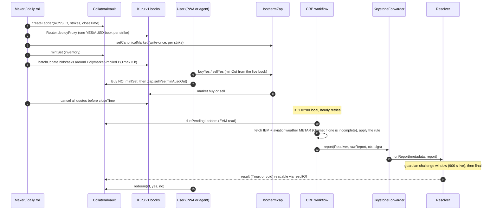

# Isotherm architecture

This document describes how Isotherm is put together: the contracts, the off-chain services, how a city-day moves from open to redemption, who is trusted with what, and what can go wrong. It describes **v1 as deployed on Monad testnet on 2026-10-07** (`deployments/testnet.json`). Numbers come from the files they cite: the feasibility runs of 2026-10-06 (`spikes/*/RESULT.md`, `script/RESULT-v0-feasibility.md`, `test/security/RESULT.md`), the v1 contracts (`script/RESULT.md`), the v1 security review (`test/security/v1/RESULT.md`), the packages' own `RESULT.md` files and the go-live evidence (`docs/evidence/golive/`). Where the feasibility build differed, the section says so.

## 1. Scope

**Goals**
- One instrument, done carefully: "Tmax(station, local day) ≥ k °C", settled on the integer-°C METAR rule that Polymarket's daily-high markets resolve on.
- Fully collateralized at all times: every outstanding YES+NO pair is backed by exactly 1 AUSD in the vault.
- Every strike tradable on its own onchain order book (Kuru v1), usable by people (phone PWA), scripts and agents (MetaMask Agent Wallet plugin).
- Settlement by a Chainlink CRE workflow from two independent public archives, with void-at-par instead of guessing.

**Non-goals for the hackathon**
- Real money. Testnet only, faucet AUSD only.
- A forecasting edge. Our model loses to Polymarket's prices in backtest, so the maker prices off Polymarket and uses the model only as a guardrail.
- Upgradeable contracts, governance, a token.

## 2. Components

| Folder | Runtime | Role |
|---|---|---|
| `src/` | Solidity 0.8.37, Monad testnet 10143 (`ForecastCommit` on mainnet 143) | Outcome tokens, ladders, collateral, settlement, forecast commitments |
| `deployments/testnet.json` | JSON | The single source of truth for addresses (written by the contracts deploy) |
| `packages/abi/` | JSON | ABIs exported from `forge` output, consumed by every TypeScript package |
| `packages/forecast/` | Node 22, zero-dependency TypeScript | METAR fetch and parse, the settlement rule (`settle-core`), Polymarket-implied ladders, the v0 forecast model, recompute CLI |
| `packages/maker/` | Node 22 + viem, long-running on a 24/7 host | Daily ladder roll, inventory, quoting, pull-at-close, kill switch |
| `packages/cre-workflow/` | Chainlink CRE TypeScript SDK, compiled to WASM | Cron-triggered settlement |
| `packages/mm-plugin/` | oclif plugin for `@metamask/agent-wallet` 7.x | Agent commands: read ladders and quotes, trade through the Zap |
| `apps/web/` | Vite + React PWA on Cloudflare Pages (https://isotherm.pages.dev) | Phone app: ladder, trade, portfolio, redeem, results with in-browser attestation check, risk card. The deployed build offers a labelled testnet burner wallet ("Dev wallet"). Builds from this tree make Dynamic email login (Sandbox environment) the default, with the dev wallet as fallback; that build is not deployed and no Dynamic login has happened yet (§9) |
| `apps/api/` | Cloudflare Worker + SQLite-backed Durable Object + KV (<former API host>) | Test-fund drip, gasless relay of signed AUSD authorizations, maker snapshot, stats API from our own log scan |
| `spikes/` | mixed | Feasibility evidence from 2026-10-06; read-only |

Packages share code by relative import or plain JSON only (no npm workspaces).

## 3. On-chain contracts

### 3.1 Identifiers

- `station`: ICAO code as ASCII `bytes4` (`"RCSS"` = `0x52435353`). Each station has a write-once UTC offset; the live deployment registers RCSS (+8 h) and RJTT (+9 h).
- `date`: the station-local calendar day as `uint32` yyyymmdd.
- `seriesId = keccak256(abi.encode(bytes4 station, uint32 date, int16 strikeC))`. One series is one strike.
- A **ladder** is all series for one (station, date). One CRE report settles the whole ladder.
- Token names look like `Isotherm RCSS 20261007 Tmax>=30C YES`, symbols like `RCSS-20261007-GE30-Y`.

### 3.2 Contracts

This table describes v1 as deployed on 2026-10-07 (`deployments/testnet.json`; Sourcify `exact_match` for Resolver, CollateralVault, IsothermZap and the OutcomeToken implementation). Addresses: Resolver `0x9c7876Bc27df6cB473f2eaFA296FdEC22747962B`, CollateralVault and StrikeFactory `0xae36cf0a163bAfCde4D40a6Ab7b5E3C762ad7B39`, IsothermZap `0x1ACaf47987Fe570df5d136Ae1CaC0D45E2B8CFb0`, OutcomeToken implementation `0x5EfaB33DDad0715b66f514Fe12d78Ca23f3e31fC`.

| Contract | Responsibility | Key functions |
|---|---|---|
| `OutcomeToken` | 6-decimal ERC-20 with EIP-2612 permit. One implementation; every YES and NO is an EIP-1167 clone with immutable args `(seriesId, station, date, strikeC, isYes)`. Only the vault can mint or burn. Permit domain: `{name:"Isotherm Outcome", version:"1", verifyingContract: clone}`, read it from `eip712Domain()` | ERC-20, `permit` |
| `StrikeFactory` (inherited by the vault) | Series registry. Operator-only creation. CREATE2 clones, so token addresses are predictable. Enforces `now < closeTime ≤ end of the station-local day` | `createLadder(station, date, int16[] strikes, closeTime)`, `createSeries`, `getSeries(id)`, `predictTokenAddress(station, date, k, isYes)` |
| `CollateralVault` | Complete sets backed 1:1 by AUSD, tracked per series with checked arithmetic; deposits are credited by balance delta. Pause stops new mints only. Optional per-series allowlist (the compliance hook for future gated series) | `mintSet`, `mintSetTo`, `mintSetWithPermit`, `mintSetWithAuthorization` (EIP-3009; the signed nonce binds series and amount via `mintAuthorizationNonce(seriesId, amount, salt)`), `redeemSet` (any time, never paused), `redeem(id, yes, no)` (once the result is final), `previewRedeem`, `payoutHalves`, `duePendingLadders(start, count)`, `setSeriesGated`, `setAllowlisted` |
| `Resolver` | Chainlink CRE `IReceiver`. Accepts a report only from the configured forwarder, only after the local day ends, only with an unexpired EIP-712 attestation (always required in v1), and only once per ladder. A settled result becomes final after a short guardian challenge window | `onReport(metadata, report)`, `challenge(station, date, reasonHash)` (guardian only), `voidIfStale(station, date)`, `resultOf`, `isFinal`, `staleAt`, `dayEnd`, `settlementDigest`, admin setters |
| `IsothermZap` | One-transaction trades on the series' **canonical** Kuru book (write-once per series, validated: base = series YES, quote = AUSD, price precision 1e4, size precision 1e6, taker fee ≤ 30 bps); trades only before the series' close; holds nothing between transactions | `setCanonicalMarket(seriesId, market)` (operator), `validateMarket`, `buyYes(seriesId, market, ausdIn, minYesOut, to)`, `sellYes(seriesId, market, yesIn, minAusdOut, to)`, `buyNo(seriesId, market, ausdIn, minAusdBack, to)` (deployed but not used by our clients: its bound fails under partial fills, see §5) |
| `ForecastCommit` (mainnet 143) | Commit-reveal log of the day's probability ladder, committed before the local day starts and never overwritable | `commit(station, date, hash)`, `reveal(station, date, int16[] strikes, uint16[] probBps, salt)` |

Sizes in the feasibility build (runtime / initcode, bytes): CollateralVault 12,122 / 21,191; Resolver 11,034 / 12,127 (about +135 B runtime after the review fix); OutcomeToken 7,140 / 8,245; ForecastCommit 6,252 / 6,525. All are under Ethereum's 24 KB limit as well as Monad's 128 KB.

### 3.3 Payout rule

After a ladder resolves with `tmax`:

| Result | YES pays | NO pays |
|---|---|---|
| Settled, `tmax ≥ k` | 1 AUSD | 0 |
| Settled, `tmax < k` | 0 | 1 AUSD |
| Void (sources disagree, no complete data, or stale) | 0.5 AUSD | 0.5 AUSD |

A settled result becomes redeemable at `finalAt = resolvedAt + challengeWindow` (a deploy-time constant, at most 2 days; **900 s on the live deployment**); during that window the guardian can only downgrade it to void. Void results, reported or stale, are final at once. That asymmetry matters for a stolen attester key: see §8. A full set always pays exactly 1. Void payouts round down; each call can lose at most 0.5 base unit (0.0000005 AUSD) as dust.

Invariants checked by the test suite (`VaultInvariant`: 5 invariants, 256 runs × 128 calls; plus `AdversarialInvariant`: 4 invariants over attack handlers): vault AUSD equals the sum of per-series collateral; the vault can always pay every outstanding claim; while unresolved, YES supply = NO supply = collateral for each series; deposits = holdings + payouts; results are write-once.

## 4. Lifecycle of one city-day



1. **Open (the day before, from 12:00 local).** The roll job (`packages/maker` `roll`) reads Polymarket's event for the city-day and picks 4–6 consecutive strikes with the most uncertainty around the **Polymarket-implied median**, trimming strikes whose implied probability is outside [0.03, 0.97] (`pickStrikes()` in `packages/forecast`). The live RCSS 2026-10-08 ladder is ≥ 28/29/30/31 °C around a median of 29 °C (`docs/evidence/golive/roll-2026-10-08.json`). Strikes are per-ladder parameters, so no contract change is needed. (The feasibility plan centred 6 strikes on our own forecast; in that run Taipei's forecast for Oct 7 was about 26 °C, so the planned 28/29/30 strikes were all tails, priced 0.16 / 0.05 / 0.01.)
   `closeTime` (minting stops; the maker stops quoting 10 minutes earlier) comes from data, not a fixed offset: `packages/forecast` measured, over 2 years of complete days, when each station's daily maximum is first reached. For RCSS the maximum was reached by 12:00 on half of days, by 15:00 on 95% and by 17:30 on 99%, so the warm-season close is 17:30 local and the chance that the high still rises after close is about 0.8%. RJTT closes at 19:30 local on the same rule. Stations without the analysis fall back to 17:30 local. The live roll used 17:30 (warm-season t99 over 368 complete days) with quoting stopping at 17:20.
2. **Quote.** See §6.
3. **Trade.** See §5.
4. **Close.** The maker cancels every quote before `closeTime`. Isotherm cannot halt a Kuru book (Kuru's Router owns it), and the day's maximum usually becomes public through METAR hours before settlement, so stale quotes would be free money for anyone watching. Users can still trade with each other on the book after close, merge pairs, or hold to settlement.
5. **Settle (D+1 02:00 local).** See §7.
6. **Redeem.** Once the result is final: right away for a void, after the challenge window (900 s on the live deployment) for a settled result. There is no optimistic-oracle proposal and dispute process.

## 5. Trading paths

Only YES has a book. NO is never listed.

| User intent | Path | Gas in the feasibility live run (billed, MON at 102 gwei) |
|---|---|---|
| Buy YES ≥ k | `Zap.buyYes`: market buy on the book, unspent AUSD refunded | 623,629 (0.0636); v1 on the live chain: 518,188 gas used (go-live smoke test) |
| Buy NO ≥ k | **v1 clients:** `vault.mintSet(seriesId, n)` (n YES + n NO to the user), then `Zap.sellYes(n YES, minAusdOut)`. NO received is exactly n, and `sellYes` reverts if fewer than `minAusdOut` AUSD come back, so the worst-case NO price is fixed before signing. Net NO price = 1 − bid − fee. Used by the web app (`apps/web/src/lib/buyNo.ts`; live on the site since its 2026-10-07 redeploy) and the plugin (`mm weather buy --side no`) | v1 `mintSet` 297,217 gas used (fork e2e), plus `sellYes` |
| (not used) | `Zap.buyNo(ausdIn, minAusdBack)`: mints, sells the YES leg, merges unsold YES back at par. Its only bound counts that merged YES at par, so under a partial fill a sandwich can pass it at a terrible NO price: on a fork with real Kuru and the deployed Zap, 0.999 per NO instead of 0.57 for half the NO (`test/security/v1/RESULT.md`, N1). Fixing it needs a Zap redeploy with a `minNoOut` bound | 824,413 (0.0841) in the feasibility build |
| Sell YES | `Zap.sellYes`, unsold YES refunded | — |
| Exit with a YES+NO pair | `vault.redeemSet`, never paused | ~160–175k |
| Sell NO before settlement | Not built. Kuru v1 market buys take a quote amount, not an exact output, so this needs an exact-output YES buy sized from the book, then a merge. The UI offers hold-to-settlement or merge | — |
| After settlement | `vault.redeem` | 162,536 (0.0166) |
| Direct book buy (no Zap) | approve the market, `placeAndExecuteMarketBuy` | 397,318 (0.0405) |

The Zap exists because Kuru books are new contracts every day: one AUSD approval to the Zap replaces one approval per market per day (Buy NO also needs one AUSD approval to the vault and, for `sellYes`, a YES approval to the Zap). In v1 it trades only on the series' canonical book (registered once by an operator and validated through `Router.verifiedMarket`: base = the series' YES token, quote = AUSD, the precisions below, taker fee ≤ 30 bps), only before the series' close, pulls funds only from `msg.sender`, uses exact approvals reset to zero, a reentrancy guard and SafeCast, and requires a non-zero min-out on every path. The feasibility Zap accepted any verified book for the YES token, which the security review showed could route a victim into a hostile 90%-fee book.

**Kuru market parameters** (all v1 books): `type 0` (both legs ERC-20), `pricePrecision 1e4`, `tickSize 10` (a 0.001 tick, prices 0.001–0.999), `sizePrecision 1e6` (one size unit = one YES base unit), `minSize 1e6`, `maxSize 1e12`, `kuruAmmSpread 100` (backstop vault left empty). Feasibility books used `takerFeeBps 10`, `makerFeeBps 0`; the 0.1% goes to Kuru's fee collector, not Isotherm. Kuru has no maximum price, so the maker, Zap callers and UI keep prices ≤ 0.999.

## 6. Pricing and the market maker

**Fair value.** For each strike, fair value is the Polymarket-implied P(Tmax ≥ k): take the latest YES price of every bucket in Polymarket's event for that city-day, normalise the bucket prices to sum to 1 (the median raw sum is 1.04), and add up the buckets whose lower bound is ≥ k. The v0 model (Open-Meteo previous-runs, 7 models, rolling bias correction, inverse-MSE weighting, empirical residual spread) is used:
- as a guardrail: a strike is flagged when |model − Polymarket| > 0.15;
- as the primary quote only before Polymarket lists the day (it lists about 2 days ahead) or for a station Polymarket does not cover.

Why: in the backtest over 381 station-days, v0 scored a pooled Brier of 0.0656 against Polymarket's 0.0594 at 23:00 the night before; the 95% CI of the difference is [+0.0030, +0.0092], so Polymarket is better. Polymarket on the morning of the day scores 0.0546, which also means the maker must react to the day's observations.

**Quoting policy** (`packages/maker`, as built; `packages/maker/RESULT.md`):
- One post-only bid and one ask per strike around fair value: half-spread 3 ticks of 0.01 (Kuru's own tick is 0.001), prices rounded outward and kept in [0.01, 0.99], bid < fair < ask always. Inventory skew up to 2 ticks; position cap ±300 YES per strike. A strike is pulled when fair ≤ 0.03 or ≥ 0.97, and when the guardrail model differs from Polymarket by more than 0.40 (a gap above 0.15 doubles the spread).
- Size each quote from free margin plus what the cancelled orders release. A fixed-size re-quote after a fill reverts with Kuru `InsufficientBalance()`; this broke the first fork run.
- Re-quote a strike only when it has no resting quote, a side filled (or less than half is left), the desired price moved by at least 2 ticks, the quote is older than 6 hours, or fair crossed a resting quote (urgent). Each live re-quote (cancel 2 + place 2) billed 0.055–0.058 MON (`docs/evidence/golive/live-txs.tsv`).
- Daily MON caps per role, metered per Taipei day (live, as of 2026-10-07: maker 1.2 MON including the next day's roll). Non-urgent re-quotes over the cap are refused; an urgent one becomes a pull paid from a reserve; the kill switch is never refused.
- On day D the observed METAR maximum conditions fair value: once a report shows Tmax ≥ k, the strike is certain and is pulled.
- Pull every quote 10 minutes before `closeTime`, from the loop, a 15-second timer and a separate launchd watchdog every 5 minutes (it acts when the loop's heartbeat is over 3 minutes old). The kill switch cancels tracked order ids plus a scan of the last 300 ids, then withdraws the YES margin.
- Track order ids from `OrderCreated` events in receipts; the public RPC's `eth_getLogs` is limited to a 100-block range.
- The maker never sends a taker order, so it never trades against its own quotes. Maker fills are always reported separately from non-maker fills.

## 7. Settlement

### 7.1 Rule

```
Tmax(station, D) = max integer °C from the METAR "TT/DD" group (M = minus)
                   over all METAR and SPECI reports with obsTime in [D 00:00 local, D+1 00:00 local)
```

- Parse the temperature group with `\s(M?\d{2})\/(M?\d{2}|\/\/)?(?=\s)` on the text before ` RMK `. Never use aviationweather's JSON `temp` field, which can carry tenths from the T-group.
- Include SPECI and :30 reports, classify reports by observation minute (IEM's `report_type=4` bucket also contains routine :30 METARs), and use the local day.
- Fidelity against Polymarket: RCSS 183/184, RJTT 209/209 (README has the full table).

### 7.2 Sources

| Source | Request | Notes |
|---|---|---|
| A: IEM ASOS | `GET mesonet.agron.iastate.edu/cgi-bin/request/asos.py?station=RCSS&data=metar&…&tz=Asia/Taipei&report_type=3&report_type=4` | CSV, local time, end-exclusive. ~5 KB, 1.3–3.7 s. Lags aviationweather by 1–2 h. Had a 158-day RCSS gap in 2025-26 |
| B: aviationweather.gov | `GET aviationweather.gov/api/data/metar?ids=RCSS&format=json&date=<local day end, UTC>&hours=24` | The window includes `date`, so drop `obsTime ≥ end`. Empty body = no data. Short, uneven retention: recent days only |
| C: Ogimet (fallback) | `GET ogimet.com/cgi-bin/getmetar?icao=RCSS&begin=…&end=…` (UTC, inclusive end) | Only when A or B is incomplete; it throttles |

**Completeness:** reports in at least 20 distinct local hours, and the last report at or after 23:00 local.

### 7.3 Decision

`packages/cre-workflow/settle/settle-core.ts` is byte-identical to `packages/forecast/src/settle-core.ts` (sha256 `119832de…3d62`, enforced by a test), and the workflow adds guards around its `decide()` without changing it (`packages/cre-workflow/RESULT.md` §1.2):

| Situation | Decision |
|---|---|
| A and B both complete and equal | SETTLED at that Tmax |
| A and B both complete but different | never settle; PENDING, then VOID after the deadline |
| A or B incomplete | fetch C (at most one Ogimet query per run); if two complete sources agree, SETTLED (2-of-3) |
| Otherwise | PENDING; retry hourly |
| Deadline | VOID only after D+1 00:00 local + 36 h **and** only if every consulted source answered with a genuine archive response, so a fetch failure never voids; a 46 h backstop voids regardless, still before the on-chain 48 h stale window |

The cron runs at 02:00 Taipei and 02:00 Tokyo (RCSS 18:00 UTC, RJTT 17:00 UTC) and hourly at :30, and nothing is attempted before D+1 00:00 local + 2 h. It pages `duePendingLadders` oldest first so a missed day is caught up, within the CRE quotas (15 HTTP calls, 15 EVM reads and 5 reports per run; the rest is deferred to the next run). Each signed report expires 25 minutes after the run's anchor time (`validUntil`).

The feasibility workflow (`spikes/cre/project/settle/metar.ts`) did not follow this table: it voided on the first disagreement, used `obs ≥ 40` as completeness, had no Ogimet fallback and ran at 00:30 local (security findings #2–#3, verification finding A). `packages/cre-workflow` replaced it.

### 7.4 Report and attestation

- Payload (v1): `abi.encode(bytes4 station, uint32 date, int16 tmaxC, bool isVoid, bytes32 sourcesHash, uint64 validUntil, bytes sig65)`.
- `sig65` is a low-s EIP-712 signature by the attester over `Settlement(bytes4 station,uint32 date,int16 tmaxC,bool isVoid,bytes32 sourcesHash,uint64 validUntil)` with domain `{name:"Isotherm Resolver", version:"1", chainId, verifyingContract: Resolver}`. A report is accepted only while `block.timestamp ≤ validUntil`, so a signed report whose delivery failed cannot be replayed later against a newer one. Reported Tmax must lie in [−90, 70] °C. The chain enforces `validUntil` but does not cap how far ahead it is set; the 25-minute lifetime is a workflow rule (N7 in `test/security/v1/RESULT.md`). `script/attestation-vector.json` is the v1 test vector, checked against the live Resolver's `settlementDigest` (`script/attestation-vector.sh`), and the workflow's signature is byte-identical to it.
- The forwarder's `rawReport` is a 109-byte header (`version | executionId | timestamp | donId | donConfigVersion | workflowId | workflowName | workflowOwner | reportId`) followed by the payload; the Resolver receives `metadata = rawReport[45:109]` and `report = rawReport[109:]`.
- Gas: an accepted whole-ladder report used 139k–156k gas through the simulator (148,685–155,961 in the feasibility build). The workflow sends a fixed 200,000 limit, so **each report transaction bills about 0.0204 MON** at 102 gwei, paid by the transaction sender (by default the attester's key; `packages/cre-workflow/RESULT.md` §2).
- **Both forwarders swallow a reverting `onReport`** and emit `ReportProcessed(result=false)` while the transaction succeeds. Success means `LadderResolved` was emitted or `resultOf` changed, never the transaction status.

### 7.5 Forwarder modes

| Mode | Forwarder | Who can call it | Authentication that matters |
|---|---|---|---|
| Simulation (`cre workflow simulate --broadcast`), used for the hackathon | `MockKeystoneForwarder` `0xB9F7…d192` | Anyone | The EIP-712 attestation only. The mock passes fixed fake metadata (workflowId `0x11…11`, owner `0xaa…aa`, timestamp 100) |
| Production (after CRE deploy access) | `KeystoneForwarder` `0xF834…4482` | The DON's transmitter, with DON signatures | DON signatures + workflow-ID/owner pinning, plus the attestation if kept on |

Going to production: `setForwarder(0xF834…4482)`, then `setExpectedWorkflow(id, owner)`. In v1 the attestation **cannot be switched off**, so the DON signatures and the attester key must both agree (the feasibility build allowed switching it off, which the security review flagged).

**Who runs it during the hackathon.** There is no DON deployment. A launchd job on a team Mac (`xyz.isotherm.cre-settle`, hourly at :05) runs the unmodified CRE CLI v1.37.0: `cre workflow simulate ./settle -T testnet --broadcast`. That is the CRE engine running the compiled WASM on one local node, delivering through the MockKeystoneForwarder. The official CLI needs a CRE login. The team logged in on 2026-10-07, and the first official run against live testnet, at 08:05 UTC, found nothing due and sent no report. An earlier run at 07:08 UTC, before the login, took the fallback and also had nothing due. If `cre whoami` fails, the job falls back to the SDK test harness: the same handler and attestation under Bun, not the CRE engine. Each run writes an evidence record naming the path (`docs/OPERATIONS.md` §6). The same official CLI settled RCSS and RJTT for 2026-10-06 against the v1 Resolver on an anvil fork (`packages/cre-workflow/evidence/sim-fork.txt`).

### 7.6 Stale void

`voidIfStale(station, date)` is open to anyone once `staleAt(station, date)` has passed with no result. In v1:
- `STALE_WINDOW = 48 h` after the local day ends, longer than the workflow's own 36 h void deadline (the feasibility build used 24 h, which gave the losing side a free option to void a ladder the workflow was still waiting to settle).
- While the Resolver is paused, stale void is blocked, and after an unpause the workflow gets `RESUME_GRACE = 24 h` to deliver first, so a guardian cannot force a void by pausing through the window.
- Liveness bound: from day end + 7 days anyone can void, paused or not, so collateral can never be locked forever.

## 8. Trust model and keys

| Role | Can | Cannot |
|---|---|---|
| Owner (live: still the deployer key `0xb855…5c11`) | Register stations (offsets write-once), set forwarder, attester, guardian, expected workflow; set per-series allowlists; unpause | Move collateral; overwrite a final result; mint tokens; switch off attestation (v1) |
| Guardian | Pause new mints (vault) and `onReport` (resolver); during the challenge window, downgrade a settled result to void (`challenge`) | Change a result to a different temperature; block exits (`redeemSet` and `redeem` work while paused); keep a ladder unresolved past day end + 7 days |
| Attester | Sign settlements; with the forwarder, decides outcomes. As the workflow's default transaction sender it also pays about 0.0204 MON per report | Settle before the day ends or settle twice |
| Operator | Create series and ladders | Touch collateral |
| Maker | Quote with its own inventory | — |
| Relayer (`apps/api`) | Submit users' signed AUSD authorizations to two fixed vault functions, drip test funds | Move user funds without a valid user signature |

The attester key is the trust anchor while CRE runs in simulation mode. Mitigations: separate keys per role, attestations that expire (`validUntil`), the guardian's challenge window, and stale void as the no-report fallback. The guardian can turn a result into a refund but never into a different winner.

**What the challenge window does not do** (`test/security/v1/RESULT.md`, N2, N3, N6):
- It **limits, but does not stop,** a thief holding the attester key. A challenged false *Settled* result becomes a void, which still pays the thief's cheap side 0.5 per token (25× on a 0.02 buy). A reported *Void* is final in the same block, so the guardian cannot challenge it at all. Proofs: `test_RESIDUAL_challengedFalseResultStillPaysTheThiefHalf`, `test_RESIDUAL_compromisedAttesterSignsVoid_finalInstantly_guardianCannotAct`. The fix needs a Resolver redeploy (and so a Vault and Zap redeploy): give reported voids the same window, and make `challenge` reset the result instead of voiding it.
- It does not help if the owner key is taken. The live owner of the Resolver and the Vault is still the deployer key, the same hot key that funds the bots; with it alone an attacker can replace the guardian and the attester and decide any pending ladder, with no timelock (`test_RESIDUAL_ownerKeyAloneControlsEveryOutcome`). Moving ownership to a cold key is 4 transactions (`transferOwnership` + `acceptOwnership` on both contracts).
- The guardian key is a hot key on the same Mac as the attester key. Since 2026-10-07 a watcher (`xyz.isotherm.challenge-watch`, every 120 s) recomputes each result and challenges a reproduced mismatch, but it runs on that same Mac, so it covers a wrong report, not a compromised machine. `pause()` neither stops nor extends the challenge clock, and the vault does not follow the Resolver's pause, so the runbook is **challenge first, then pause** (`test_RESIDUAL_pauseDoesNotFreezeTheChallengeClockOrRedemption`).

Admins can never move collateral. The contracts never hold or send MON, so Monad's reserve-balance rule only affects EOAs: an account under 10 MON can send value only in an "emptying" transaction (no other transaction from it in the previous 3 blocks), which is why top-ups are spaced out.

## 9. Onboarding, wallets and gas

- **Login.** Dynamic email login (`apps/web/src/wallet/dynamic.tsx`, lazy-loaded: `DynamicContextProvider` with `EthereumWalletConnectors`; the sign-in button opens Dynamic's auth flow with `setShowAuthFlow`) is designed around Dynamic's TSS-MPC embedded wallet. With smart wallets off, that wallet is a plain EOA, so its signatures verify with ecrecover. The app signs through `primaryWallet.getWalletClient('10143')`. **State on 2026-10-07:**
  - A Dynamic Sandbox environment exists. Its public settings show email login only, automatic embedded-wallet creation (EVM) and smart wallets off. Its ID is a public value, kept in `apps/web/.env.production`.
  - Builds from this tree therefore make "Sign in with email" the default, with the burner wallet as a fallback. On localhost, in both the dev and the production build, the SDK loads the real environment and Dynamic's login modal renders (`apps/web/evidence/dynamic/`).
  - **Nobody has logged in yet**, so no embedded wallet exists and nothing has been signed by one. The deployed app still offers only a labelled testnet burner wallet ("Dev wallet", key kept in the browser's localStorage), and the Dynamic build stays undeployed until a test-account login, a relayed mint and a Buy Yes from the embedded wallet pass on testnet.
  - Monad Testnet is not yet enabled in the environment's dashboard (only Ethereum Mainnet is listed). The app injects 10143 and 143 through `overrides.evmNetworks` with `mergeNetworks`, which Dynamic documents for networks it does not support out of the box. That this works for an embedded wallet on 10143 is unproven.
- **No Dynamic gas sponsorship on Monad.** Dynamic's supported-chain list excludes 143 and 10143, and the 7702 delegate it uses has no code on either chain. Isotherm therefore relays:
  - the user signs an EIP-3009 `receiveWithAuthorization` for AUSD (domain `"Agora Dollar"` v1, chainId 10143; `name()` returns `"AUSD"`, which is not the signing name), whose nonce the vault recomputes as `keccak256(abi.encode(seriesId, amount, salt))`, so the authorization is bound to the series, the amount and this vault;
  - the relayer verifies signature, nonce, balance, time window, minimum and maximum amount, and its caps before submitting;
  - `receiveWithAuthorization` is front-run-safe because only the payee can execute it. A plain EIP-2612 permit does not bind the series, so a front-runner could redirect a relayed `mintSetWithPermit` to another open series; the API therefore does not relay permits for the v1 vault (`RELAY_ALLOW_PERMIT = "0"`, N10).
- **Drip.** The AUSD faucet has one 60-second cooldown shared by every caller on the testnet, so the drip pays from the relayer's own AUSD float and returns HTTP 429 instead of hammering the faucet.
- **Where the relayer runs.** `apps/api` is a Cloudflare Worker. Its relayer lives in a Durable Object (one sender, so no nonce races) and signs with its own relayer key, not a Dynamic server wallet: Dynamic's server-wallet SDK ships native addons for Linux and macOS only, so it cannot run inside a Worker. The relayer submits `mintSetWithAuthorization` (EIP-3009), and a once-a-minute cron refills its AUSD float and advances the log scan (`apps/RESULT.md`).
- **Relayer budget.** Testnet MON is scarce and the relayer pays every drip (0.15 MON + gas) and every relayed mint (about 0.034 MON). Its daily caps in `apps/api/wrangler.toml` are sized from its live balance by `apps/api/scripts/size-caps.mjs`, which spreads the spendable MON over several worst-case days (`--days`, default 7) so one day cannot spend it all. At the v1 review the relayer held 0.599 MON, which gave 2 drips and 5 relayed mints per day. After a top-up it held 4.599 MON. The caps were re-sized from that balance over 7 days and deployed at 2026-10-07 08:02 UTC. `/api/health` `limits` at 08:40 UTC shows the live caps:
  - 2 drips per UTC day, at most 1 per network, and one drip per address per 24 h;
  - 9 relayed mints per UTC day, at most 4 per network and 4 per address;
  - a 0.1 MON reserve that drips and relays never spend.

  At full use that budget covers UTC days Oct 7–13. IPv6 clients are rate-limited per /64, and relayed mints must be between 1 and 500 AUSD (N5). The caps race (N4) is closed by re-checking them inside the single-sender queue.
- **Gas limits.** Monad bills the gas limit. Every transaction is estimated, then sent with a 1.05–1.10× limit (fixed 200k for CRE reports). On the fork and in the live roll, estimates equalled gas used.

## 10. Agent access (MetaMask Agent Wallet plugin)

- An oclif user plugin for `mm` 7.x, loaded with `experimentalPlugins=true`. Each command declares `wallet-read` or `wallet-submit`; submissions go through `ctx.walletExecutor`, which signs locally and posts to MetaMask's policy service, which decides and broadcasts. That signed-in path has not run yet: the plugin's evidence so far runs the real `mm` 7.0.0 binary against a local stand-in for MetaMask's backend (`harness/stub-backend.mjs`, with an unsigned test session) on an anvil fork (`packages/mm-plugin/README.md`).
- MetaMask's hosted RPC gateway rejects chain 10143 (`HTTP 400 {"error":"Invalid chainId"}`), while its signing service lists 10143 with `guardSupported: true`. The setup script adds a `customEvmChains` entry for 10143; read commands fall back to a direct RPC.
- Installing by npm name uninstalls itself in 7.0.0, and a `file:` install fails with `PLUGIN_INVALID_BASE`; install from a tarball URL.

## 11. Gas and testnet-MON budget

**Projected per-day budget.** Each row's gas was measured per transaction on live testnet in the feasibility run (billed = gas limit, at 102 gwei); the daily total multiplies those by the counts in the table. It is a projection: no full city-day at this rate has been run.

| Item | Count per city-day | Gas | MON |
|---|---|---|---|
| `createLadder`, 6 strikes (12 clones) | 1 | 1,696,294 | 0.1730 |
| Kuru `deployProxy`, one book per strike | 6 | 1,467,042 | 0.8978 |
| Maker `mintSet` / approve YES / deposit YES | 6 each | 298,324 / 69,770 / 167,259 | 0.3277 |
| Maker AUSD deposit | 1 | 127,950 | 0.0131 |
| Initial quote, 1 bid + 1 ask | 6 | 592,834 | 0.3628 |
| Hourly re-quote (cancel 2 + place 2) | 144 | 526,091 | 7.7272 |
| Pull quotes at close | 6 | 280,631 | 0.1717 |
| CRE report (we pay in simulation mode) | 1 | 220,000 | 0.0224 |
| Maker withdraw + redeem | 1 + 6 | 301,694 / 189,459 | 0.1467 |
| **Total** | | | **9.842** (fixed 2.115 + re-quotes 7.727) |

Projected alternatives: re-quoting only strikes that moved by a tick, ~5.98 MON/day; every 30 minutes, ~17.57 MON/day. v1 adds one `Zap.setCanonicalMarket` per strike (~135k gas, 0.0138 MON) and sends CRE reports with a 200k limit (0.0204 MON). The v1 core deploy (Resolver + Vault + Zap + stations + operator) billed 1.0625 MON (10,315,665 gas at 103 gwei, `deployments/testnet.json`).

**Measured live (v1 go-live, 2026-10-07, 4-strike RCSS ladder; `docs/evidence/golive/txs-roll.jsonl`, `live-txs.tsv`).** Gas limit equalled gas used on every transaction, at 102 gwei:

| Item | Txs | Gas used per tx | MON billed |
|---|---|---|---|
| `createLadder`, 4 strikes (8 clones) | 1 | 1,200,653 | 0.1225 |
| Kuru `deployProxy` | 4 | 1,467,029–1,467,042 | 0.5986 |
| `Zap.setCanonicalMarket` | 4 | 135,404–135,417 | 0.0553 |
| Maker AUSD approve + `mintSet` ×300 per strike | 5 | 77,164; 302,883–321,402 | 0.1333 |
| Maker margin: AUSD deposit + per-strike YES approve and deposit | 9 | 68,502–164,218 | 0.1096 |
| Initial quotes, 1 bid + 1 ask | 4 | 582,088–582,164 | 0.2375 |
| **Roll total** (27 txs in 64 s) | 27 | | **1.2568** (operator key 0.7761, maker 0.4805) |
| Live re-quotes after the roll (cancel 2 + place 2) | 3 | 536,884–567,427 | 0.1705 (0.055–0.058 each) |

The live maker caps itself at 1.2 MON per Taipei day as of 2026-10-07 (including the next day's roll), so it re-quotes far less than hourly; see §6 and `docs/OPERATIONS.md`.

## 12. Failure modes

| Failure | What happens |
|---|---|
| One archive is down or late | Fallback source C; otherwise PENDING, retry hourly, VOID at par after the deadline |
| Sources disagree | Never settle; VOID at par after the deadline |
| CRE never reports | Anyone calls `voidIfStale` after the stale window (48 h, or 7 days at the latest); every token redeems at 0.5 |
| Bad report about to land | Guardian pauses the Resolver; exits stay open |
| Bad *Settled* report landed | Guardian calls `challenge` within the challenge window (**challenge first, then pause**: pausing does not stop the clock); the ladder becomes void (0.5 / 0.5), which still pays a key thief's cheap side 0.5 |
| Bad *Void* report landed | Final at once; the guardian cannot act (N2). Only a Resolver redeploy fixes this |
| Report delivery fails (sent early, out of gas) | The forwarder emits `result=false`; the attestation expires at `validUntil` (25 minutes) and the next hourly run tries again |
| Maker bot dies mid-day | Watchdog pulls all quotes; books may sit empty; users can still merge pairs or hold to settlement |
| Someone creates a second Kuru book for our YES token | Market creation on testnet is permissionless. The v1 Zap trades only on the canonical book registered for the series (write-once, fee-capped), and every client passes a `minOut` computed from that book. Direct trades on a lookalike book are outside our control |
| Faucet cooldown | Drip pays from float; HTTP 429 when the float is empty |

## 13. Security review status

Two internal adversarial reviews, no external audit: the feasibility contracts (`test/security/RESULT.md`, 2026-10-06: no critical, 7 medium) and the v1 diff plus the API (`test/security/v1/RESULT.md`, 2026-10-07). Status of the earlier findings on the **deployed** v1 contracts, as the v1 review re-checked them:

| # | Earlier finding | v1 status |
|---|---|---|
| 1 | Attestation could be switched off behind a permissionless forwarder | **Fixed**: the switch is gone; every report must be signed |
| 2 | Stale void at 24 h was a free option for the losing side (workflow deadline 36 h) | **Fixed**: `STALE_WINDOW = 48 h` (fuzzed: never fires before day end + 48 h) |
| 3 | The CRE workflow voided on the first source disagreement | **Fixed off-chain** in `packages/cre-workflow` (§7.3; read by the reviewer, not re-run) |
| 4 | The Zap accepted any Kuru-verified book for the YES token | **Fixed**: one write-once canonical market per strike; all 4 live books pass `validateMarket` |
| 5 | Kuru books keep matching after close; stale maker quotes are free money | **Residual, off-chain**: the maker's kill switch pulls quotes 10 minutes before close (§6) |
| 6 | The guardian alone could force a void by pausing through the stale window | **Fixed**: stale void is blocked while paused, 24 h resume grace, 7-day hard bound |
| 7 | One hot attester key is final | **Partly**: a 15-minute challenge window for *Settled* results and expiring attestations; see N2 |
| 8 | A permit does not bind the series | **Fixed for EIP-3009** (nonce binds series, amount and vault instance); permit relays are off in the API |
| 9 | Attestations never expired | **Fixed**: `validUntil` enforced (not capped on chain: N7) |
| 10 | Fee-on-transfer collateral | **Fixed** with a balance-delta check |

New findings in the v1 review, and what was done:

| ID | Severity | Finding | Status |
|---|---|---|---|
| N1 | Medium | `Zap.buyNo`'s slippage bound fails under partial fills (sandwich proven on a fork with the deployed Zap) | Clients route Buy NO through `vault.mintSet` + `Zap.sellYes(minAusdOut)` (§5; live in the web app since its 2026-10-07 redeploy). `minNoOut` needs a Zap redeploy |
| N2 | Medium | The challenge window does not contain a stolen attester key: reported voids are final at once, and a challenged result still pays the thief 0.5 | Documented here and in the README; the fix needs a Resolver redeploy (then Vault and Zap) |
| N3 | Medium | The owner of the Resolver and the Vault is still the deployer hot key | Human action: move ownership to a cold key (4 txs) |
| N4 | Medium (API) | Relay caps were check-then-act, so parallel requests passed them | Fixed and deployed: re-checked inside the single-sender queue |
| N5 | Medium (API) | Anyone could drain the relayer: IPv6 not bucketed, no relay IP limit, 1-unit mints, caps far above the balance | Fixed and deployed: /64 bucketing, per-IP relay limit, 1 AUSD minimum, caps sized to the balance |
| N6 | Low–Medium | Nobody watched the challenge window; pause does not stop its clock | Runbook: challenge first, then pause (`docs/OPERATIONS.md`). A watcher now runs every 120 s on this Mac (`packages/cre-workflow`); one on a separate machine holding only the guardian key is still to do |
| N7 | Low | `validUntil` is not capped on chain | Workflow rule (25 minutes); cap at the next redeploy |
| N8, N9 | Low (API) | Uncached `/api/health`; unsanitised Polymarket link | Fixed and deployed |
| N10 | Info | Recipient-only compliance gate; permit-mode relays; Kuru owner powers; stale pending nonce | Permit relays off; the rest documented |

The Worker was redeployed with the API fixes on 2026-10-07: a read of `/api/health` at 07:12 UTC showed `relayModes: ["authorization"]`, `relayMinAusd: 1` and the new daily caps (2 drips, 5 relays, sized from the relayer's 0.599 MON at the time). After the relayer was topped up, the caps were re-sized with `size-caps.mjs` over a 7-day horizon from 4.599 MON. The Worker was redeployed at 08:02 UTC (version `ea73ccfa`, build `a41d37d-dirty`). Live values from `/api/health` at 08:40 UTC:

| Setting | Value |
|---|---|
| Relay mode | `relayModes: ["authorization"]` |
| Relay amount | 1–500 AUSD |
| Reserve | `reserveMon: 0.1` |
| Drips | `dripDailyCap: 2`, `dripPerIpPerDay: 1`, `dripAddressCooldownH: 24` |
| Relays | `relayDailyCap: 9`, `relayPerIpPerDay: 4`, `relayPerAddressPerDay: 4` |
| Balance | `monBalance: 4.599171502` |
| Use so far | `dripsToday: 3`, `relaysToday: 0`, `relayedTotal: 0`. The 3 drips predate this deploy; with the day's cap already used, `dripReady` is false |

Evidence: `apps/api/evidence/size-caps-2026-10-07-r2.txt` and `live-verify-2026-10-07-r2.txt`. The caps are re-sized from the live balance after each top-up (`docs/OPERATIONS.md` §5).

Before any real money: redeploy the Resolver, Vault and Zap with the N1, N2, N6 and N7 changes, and leave the live RCSS 2026-10-08 ladder on v1 until it settles.

## 14. Observability

- `deployments/testnet.json` lists every address. Dashboards and the stats page read our own event log poller (stored in Cloudflare KV), because the public RPC limits `eth_getLogs` to 100 blocks.
- Stats separate maker fills from non-maker fills and count distinct non-maker wallets, settled city-days (each with its CRE transaction hash) and ForecastCommits.
- Anyone can recompute a settled day from the public archives (`cd packages/forecast && npm run settle -- RCSS 2026-10-08`) and compare it with `Resolver.resultOf`; the web app's Results screen also recovers the attestation signer in the browser.
