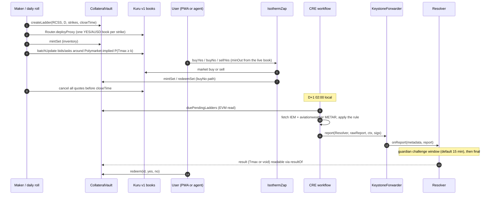

# Isotherm architecture

This document describes how Isotherm is put together: the contracts, the off-chain services, how a city-day moves from open to redemption, who is trusted with what, and what can go wrong. Numbers come from the feasibility runs on 2026-10-06 (`spikes/*/RESULT.md`, `script/RESULT.md`, `test/security/RESULT.md`). Where the v1 product differs from the feasibility build, the section says so and carries a `TODO(ship)` until the owning package confirms it.

## 1. Scope

**Goals**
- One instrument, done carefully: "Tmax(station, local day) ≥ k °C", settled on the integer-°C METAR rule that Polymarket's daily-high markets resolve on.
- Fully collateralized at all times: every outstanding YES+NO pair is backed by exactly 1 AUSD in the vault.
- Every strike tradable on its own onchain order book (Kuru v1), usable by people (phone PWA), scripts and agents (MetaMask Agent Wallet plugin).
- Settlement by a Chainlink CRE workflow from two independent public archives, with void-at-par instead of guessing.

**Non-goals for the hackathon**
- Real money. Testnet only, faucet AUSD only.
- A forecasting edge. Our model loses to Polymarket's prices in backtest, so the maker prices off Polymarket and uses the model only as a guardrail.
- Upgradeable contracts, governance, a token.

## 2. Components

| Folder | Runtime | Role |
|---|---|---|
| `src/` | Solidity 0.8.37, Monad testnet 10143 (`ForecastCommit` on mainnet 143) | Outcome tokens, ladders, collateral, settlement, forecast commitments |
| `deployments/testnet.json` | JSON | The single source of truth for addresses (written by the contracts deploy) |
| `packages/abi/` | JSON | ABIs exported from `forge` output, consumed by every TypeScript package |
| `packages/forecast/` | Node 22, zero-dependency TypeScript | METAR fetch and parse, the settlement rule (`settle-core`), Polymarket-implied ladders, the v0 forecast model, recompute CLI |
| `packages/maker/` | Node 22 + viem, long-running on a 24/7 host | Daily ladder roll, inventory, quoting, pull-at-close, kill switch |
| `packages/cre-workflow/` | Chainlink CRE TypeScript SDK, compiled to WASM | Cron-triggered settlement |
| `packages/mm-plugin/` | oclif plugin for `@metamask/agent-wallet` 7.x | Agent commands: read ladders and quotes, trade through the Zap |
| `apps/web/` | Vite + React PWA on Cloudflare Pages | Phone app: Dynamic email/Google login, embedded wallet, ladder, trade, portfolio, redeem, risk card |
| `apps/api/` | Cloudflare Worker + KV | Test-fund drip, gasless relay of signed AUSD authorizations, stats API from our own log poller |
| `spikes/` | mixed | Feasibility evidence from 2026-10-06; read-only |

Packages share code by relative import or plain JSON only (no npm workspaces).

## 3. On-chain contracts

### 3.1 Identifiers

- `station`: ICAO code as ASCII `bytes4` (`"RCSS"` = `0x52435353`). Each station has a write-once UTC offset (RCSS +8 h, RJTT +9 h, ZGSZ +8 h, RKSI +9 h).
- `date`: the station-local calendar day as `uint32` yyyymmdd.
- `seriesId = keccak256(abi.encode(bytes4 station, uint32 date, int16 strikeC))`. One series is one strike.
- A **ladder** is all series for one (station, date). One CRE report settles the whole ladder.
- Token names look like `Isotherm RCSS 20261007 Tmax>=30C YES`, symbols like `RCSS-20261007-GE30-Y`.

### 3.2 Contracts

This table describes v1 as it stands in `src/` on 2026-10-07 (review fixes applied, not yet deployed; `TODO(ship)` re-check against the deployed bytecode and `deployments/testnet.json`).

| Contract | Responsibility | Key functions |
|---|---|---|
| `OutcomeToken` | 6-decimal ERC-20 with EIP-2612 permit. One implementation; every YES and NO is an EIP-1167 clone with immutable args `(seriesId, station, date, strikeC, isYes)`. Only the vault can mint or burn. Permit domain: `{name:"Isotherm Outcome", version:"1", verifyingContract: clone}`, read it from `eip712Domain()` | ERC-20, `permit` |
| `StrikeFactory` (inherited by the vault) | Series registry. Operator-only creation. CREATE2 clones, so token addresses are predictable. Enforces `now < closeTime ≤ end of the station-local day` | `createLadder(station, date, int16[] strikes, closeTime)`, `createSeries`, `getSeries(id)`, `predictTokenAddress(station, date, k, isYes)` |
| `CollateralVault` | Complete sets backed 1:1 by AUSD, tracked per series with checked arithmetic; deposits are credited by balance delta. Pause stops new mints only. Optional per-series allowlist (the compliance hook for future gated series) | `mintSet`, `mintSetTo`, `mintSetWithPermit`, `mintSetWithAuthorization` (EIP-3009; the signed nonce binds series and amount via `mintAuthorizationNonce(seriesId, amount, salt)`), `redeemSet` (any time, never paused), `redeem(id, yes, no)` (once the result is final), `previewRedeem`, `payoutHalves`, `duePendingLadders(start, count)`, `setSeriesGated`, `setAllowlisted` |
| `Resolver` | Chainlink CRE `IReceiver`. Accepts a report only from the configured forwarder, only after the local day ends, only with an unexpired EIP-712 attestation (always required in v1), and only once per ladder. A settled result becomes final after a short guardian challenge window | `onReport(metadata, report)`, `challenge(station, date, reasonHash)` (guardian only), `voidIfStale(station, date)`, `resultOf`, `isFinal`, `staleAt`, `dayEnd`, `settlementDigest`, admin setters |
| `IsothermZap` | One-transaction trades on the series' **canonical** Kuru book (write-once per series, validated: base = series YES, quote = AUSD, price precision 1e4, size precision 1e6, taker fee ≤ 30 bps); trades only before the series' close; holds nothing between transactions | `setCanonicalMarket(seriesId, market)` (operator), `validateMarket`, `buyYes(seriesId, market, ausdIn, minYesOut, to)`, `buyNo(seriesId, market, ausdIn, minAusdBack, to)`, `sellYes(seriesId, market, yesIn, minAusdOut, to)` |
| `ForecastCommit` (mainnet 143) | Commit-reveal log of the day's probability ladder, committed before the local day starts and never overwritable | `commit(station, date, hash)`, `reveal(station, date, int16[] strikes, uint16[] probBps, salt)` |

Sizes in the feasibility build (runtime / initcode, bytes): CollateralVault 12,122 / 21,191; Resolver 11,034 / 12,127 (about +135 B runtime after the review fix); OutcomeToken 7,140 / 8,245; ForecastCommit 6,252 / 6,525. All are under Ethereum's 24 KB limit as well as Monad's 128 KB.

### 3.3 Payout rule

After a ladder resolves with `tmax`:

| Result | YES pays | NO pays |
|---|---|---|
| Settled, `tmax ≥ k` | 1 AUSD | 0 |
| Settled, `tmax < k` | 0 | 1 AUSD |
| Void (sources disagree, no complete data, or stale) | 0.5 AUSD | 0.5 AUSD |

A settled result becomes redeemable at `finalAt = resolvedAt + challengeWindow` (a deploy-time constant: 15 minutes by default, at most 2 days); during that window the guardian can only downgrade it to void. Void results are final at once. A full set always pays exactly 1. Void payouts round down; each call can lose at most 0.5 base unit (0.0000005 AUSD) as dust.

Invariants checked by the test suite (256 runs × 128 calls, plus an adversarial invariant suite with 8 attack selectors): vault AUSD equals the sum of per-series collateral; the vault can always pay every outstanding claim; while unresolved, YES supply = NO supply = collateral for each series; deposits = holdings + payouts; results are write-once.

## 4. Lifecycle of one city-day



1. **Open (the day before).** Pick 6 strikes centred on the forecast (for example μ−2 … μ+3). In the feasibility run, Taipei's forecast for Oct 7 was about 26 °C, so the planned 28/29/30 strikes were all tails, priced 0.16 / 0.05 / 0.01. Strikes are per-ladder parameters, so no contract change is needed.
   `closeTime` (minting stops; the maker stops quoting 10 minutes earlier) comes from data, not a fixed offset: `packages/forecast` measured, over 2 years of complete days, when each station's daily maximum is first reached. For RCSS the maximum was reached by 12:00 on half of days, by 15:00 on 95% and by 17:30 on 99%, so the warm-season close is 17:30 local and the chance that the high still rises after close is about 0.8%. RJTT closes at 19:30 local on the same rule. Stations without the analysis fall back to 17:30 local. (As of 2026-10-07; `TODO(ship)` confirm the values the roll job uses.)
2. **Quote.** See §6.
3. **Trade.** See §5.
4. **Close.** The maker cancels every quote before `closeTime`. Isotherm cannot halt a Kuru book (Kuru's Router owns it), and the day's maximum usually becomes public through METAR hours before settlement, so stale quotes would be free money for anyone watching. Users can still trade with each other on the book after close, merge pairs, or hold to settlement.
5. **Settle (D+1 02:00 local).** See §7.
6. **Redeem.** Once the result is final: right away for a void, after the challenge window (default 15 minutes) for a settled result. There is no optimistic-oracle proposal and dispute process.

## 5. Trading paths

Only YES has a book. NO is never listed.

| User intent | Path | Gas in the feasibility live run (billed, MON at 102 gwei) |
|---|---|---|
| Buy YES ≥ k | `Zap.buyYes`: market buy on the book, unspent AUSD refunded | 623,629 (0.0636) |
| Buy NO ≥ k | `Zap.buyNo`: mint a complete set, sell the YES leg on the book, keep NO. Net NO price = 1 − bid − fee. Unsold YES is merged back into AUSD | 824,413 (0.0841) |
| Sell YES | `Zap.sellYes`, unsold YES refunded | — |
| Exit with a YES+NO pair | `vault.redeemSet`, never paused | ~160–175k |
| Sell NO before settlement | Not built. Kuru v1 market buys take a quote amount, not an exact output, so this needs an exact-output YES buy sized from the book, then a merge. The UI offers hold-to-settlement or merge | — |
| After settlement | `vault.redeem` | 162,536 (0.0166) |
| Direct book buy (no Zap) | approve the market, `placeAndExecuteMarketBuy` | 397,318 (0.0405) |

The Zap exists because Kuru books are new contracts every day: one AUSD approval to the Zap replaces one approval per market per day. In v1 it trades only on the series' canonical book (registered once by an operator and validated through `Router.verifiedMarket`: base = the series' YES token, quote = AUSD, the precisions below, taker fee ≤ 30 bps), only before the series' close, pulls funds only from `msg.sender`, uses exact approvals reset to zero, a reentrancy guard and SafeCast, and requires a non-zero min-out on every path. The feasibility Zap accepted any verified book for the YES token, which the security review showed could route a victim into a hostile 90%-fee book.

**Kuru market parameters** (all v1 books): `type 0` (both legs ERC-20), `pricePrecision 1e4`, `tickSize 10` (a 0.001 tick, prices 0.001–0.999), `sizePrecision 1e6` (one size unit = one YES base unit), `minSize 1e6`, `maxSize 1e12`, `kuruAmmSpread 100` (backstop vault left empty). Feasibility books used `takerFeeBps 10`, `makerFeeBps 0`; the 0.1% goes to Kuru's fee collector, not Isotherm. Kuru has no maximum price, so the maker, Zap callers and UI keep prices ≤ 0.999.

## 6. Pricing and the market maker

**Fair value.** For each strike, fair value is the Polymarket-implied P(Tmax ≥ k): take the latest YES price of every bucket in Polymarket's event for that city-day, normalise the bucket prices to sum to 1 (the median raw sum is 1.04), and add up the buckets whose lower bound is ≥ k. The v0 model (Open-Meteo previous-runs, 7 models, rolling bias correction, inverse-MSE weighting, empirical residual spread) is used:
- as a guardrail: a strike is flagged when |model − Polymarket| > 0.15;
- as the primary quote only before Polymarket lists the day (it lists about 2 days ahead) or for a station Polymarket does not cover.

Why: in the backtest over 381 station-days, v0 scored a pooled Brier of 0.0656 against Polymarket's 0.0594 at 23:00 the night before; the 95% CI of the difference is [+0.0030, +0.0092], so Polymarket is better. Polymarket on the morning of the day scores 0.0546, which also means the maker must react to the day's observations.

**Quoting policy** (`packages/maker`; `TODO(ship): confirm each item against the implementation`):
- One bid and one ask per strike around fair value, with an inventory-based skew and per-strike inventory caps.
- Size each quote from free margin plus what the cancelled orders release. A fixed-size re-quote after a fill reverts with Kuru `InsufficientBalance()`; this broke the first fork run.
- Re-quote only when fair value moves by at least one tick. Hourly re-quoting of all 6 strikes costs 7.727 MON/day; re-quoting only moved strikes about halves that.
- On day D, use the observed maximum so far as a floor: once a METAR report shows Tmax ≥ k, the strike is effectively decided, so stop quoting it.
- Pull every quote before `closeTime`, from a separate watchdog as well as the main loop. Kill switch: cancel all and stop.
- Track order ids from `OrderCreated` events in receipts; the public RPC's `eth_getLogs` is limited to a 100-block range.
- The maker never trades against its own quotes. Maker fills are always reported separately from non-maker fills.

## 7. Settlement

### 7.1 Rule

```
Tmax(station, D) = max integer °C from the METAR "TT/DD" group (M = minus)
                   over all METAR and SPECI reports with obsTime in [D 00:00 local, D+1 00:00 local)
```

- Parse the temperature group with `\s(M?\d{2})\/(M?\d{2}|\/\/)?(?=\s)` on the text before ` RMK `. Never use aviationweather's JSON `temp` field, which can carry tenths from the T-group.
- Include SPECI and :30 reports, classify reports by observation minute (IEM's `report_type=4` bucket also contains routine :30 METARs), and use the local day.
- Fidelity against Polymarket: RCSS 183/184, RJTT 209/209 (README has the full table).

### 7.2 Sources

| Source | Request | Notes |
|---|---|---|
| A: IEM ASOS | `GET mesonet.agron.iastate.edu/cgi-bin/request/asos.py?station=RCSS&data=metar&…&tz=Asia/Taipei&report_type=3&report_type=4` | CSV, local time, end-exclusive. ~5 KB, 1.3–3.7 s. Lags aviationweather by 1–2 h. Had a 158-day RCSS gap in 2025-26 |
| B: aviationweather.gov | `GET aviationweather.gov/api/data/metar?ids=RCSS&format=json&date=<local day end, UTC>&hours=24` | The window includes `date`, so drop `obsTime ≥ end`. Empty body = no data. Short, uneven retention: recent days only |
| C: Ogimet (fallback) | `GET ogimet.com/cgi-bin/getmetar?icao=RCSS&begin=…&end=…` (UTC, inclusive end) | Only when A or B is incomplete; it throttles |

**Completeness:** reports in at least 20 distinct local hours, and the last report at or after 23:00 local.

### 7.3 Decision

| Situation | Decision |
|---|---|
| A and B both complete and equal | SETTLED at that Tmax |
| A and B both complete but different | never settle; VOID at the deadline |
| A or B incomplete | fetch C; if two complete sources agree, SETTLED |
| Otherwise | PENDING; retry hourly; VOID after D+1 00:00 local + 36 h |

The cron runs at D+1 02:00 local (RCSS 18:00 UTC, RJTT 17:00 UTC) and retries hourly. It walks `duePendingLadders` with a cursor so a missed day is caught up. A signed outcome for a (station, date) is persisted and reused, so the workflow never signs two different outcomes for one ladder.

`TODO(ship)`: the feasibility workflow (`spikes/cre/project/settle/metar.ts`) did not yet follow this table. It voided on the first disagreement, used `obs ≥ 40` as completeness, had no Ogimet fallback, and ran at 00:30 local (security findings #2–#3, verification finding A). Confirm that `packages/cre-workflow` ports `settle-core` unchanged.

### 7.4 Report and attestation

- Payload (v1): `abi.encode(bytes4 station, uint32 date, int16 tmaxC, bool isVoid, bytes32 sourcesHash, uint64 validUntil, bytes sig65)`.
- `sig65` is a low-s EIP-712 signature by the attester over `Settlement(bytes4 station,uint32 date,int16 tmaxC,bool isVoid,bytes32 sourcesHash,uint64 validUntil)` with domain `{name:"Isotherm Resolver", version:"1", chainId, verifyingContract: Resolver}`. A report is accepted only while `block.timestamp ≤ validUntil`, so a signed report whose delivery failed cannot be replayed later against a newer one. Reported Tmax must lie in [−90, 70] °C. (The feasibility build had no `validUntil`; its test vector is `script/attestation-vector.json`, `TODO(ship)` regenerate for v1.)
- The forwarder's `rawReport` is a 109-byte header (`version | executionId | timestamp | donId | donConfigVersion | workflowId | workflowName | workflowOwner | reportId`) followed by the payload; the Resolver receives `metadata = rawReport[45:109]` and `report = rawReport[109:]`.
- Gas: a whole-ladder settlement used 148,685–155,961 gas; send it with a fixed limit of about 180–220k (never below ~170k).
- **Both forwarders swallow a reverting `onReport`** and emit `ReportProcessed(result=false)` while the transaction succeeds. Success means `LadderResolved` was emitted or `resultOf` changed, never the transaction status.

### 7.5 Forwarder modes

| Mode | Forwarder | Who can call it | Authentication that matters |
|---|---|---|---|
| Simulation (`cre workflow simulate --broadcast`), used for the hackathon | `MockKeystoneForwarder` `0xB9F7…d192` | Anyone | The EIP-712 attestation only. The mock passes fixed fake metadata (workflowId `0x11…11`, owner `0xaa…aa`, timestamp 100) |
| Production (after CRE deploy access) | `KeystoneForwarder` `0xF834…4482` | The DON's transmitter, with DON signatures | DON signatures + workflow-ID/owner pinning, plus the attestation if kept on |

Going to production: `setForwarder(0xF834…4482)`, then `setExpectedWorkflow(id, owner)`. In v1 the attestation **cannot be switched off**, so the DON signatures and the attester key must both agree (the feasibility build allowed switching it off, which the security review flagged).

### 7.6 Stale void

`voidIfStale(station, date)` is open to anyone once `staleAt(station, date)` has passed with no result. In v1:
- `STALE_WINDOW = 48 h` after the local day ends, longer than the workflow's own 36 h void deadline (the feasibility build used 24 h, which gave the losing side a free option to void a ladder the workflow was still waiting to settle).
- While the Resolver is paused, stale void is blocked, and after an unpause the workflow gets `RESUME_GRACE = 24 h` to deliver first, so a guardian cannot force a void by pausing through the window.
- Liveness bound: from day end + 7 days anyone can void, paused or not, so collateral can never be locked forever.

## 8. Trust model and keys

| Role | Can | Cannot |
|---|---|---|
| Owner | Register stations (offsets write-once), set forwarder, attester, guardian, expected workflow; set per-series allowlists; unpause | Move collateral; overwrite a final result; mint tokens; switch off attestation (v1) |
| Guardian | Pause new mints (vault) and `onReport` (resolver); during the challenge window, downgrade a settled result to void (`challenge`) | Change a result to a different temperature; block exits (`redeemSet` and `redeem` work while paused); keep a ladder unresolved past day end + 7 days |
| Attester | Sign settlements; with the forwarder, decides outcomes | Settle before the day ends or settle twice |
| Operator | Create series and ladders | Touch collateral |
| Maker | Quote with its own inventory | — |
| Relayer (`apps/api`) | Submit users' signed AUSD authorizations to allowlisted destinations, drip test funds | Move user funds without a valid user signature |

The attester key is the trust anchor while CRE runs in simulation mode. Mitigations: separate keys per role (owner on a key no bot uses), attestations that expire (`validUntil`), the guardian's challenge window to downgrade a wrong settled result to void before anyone can redeem it, and stale void as the no-report fallback. The guardian can turn a result into a refund but never into a different winner.

Admins can never move collateral. The contracts never hold or send MON, so Monad's reserve-balance rule only affects EOAs: an account under 10 MON can send value only in an "emptying" transaction (no other transaction from it in the previous 3 blocks), which is why top-ups are spaced out.

## 9. Onboarding, wallets and gas

- **Login.** Dynamic email or Google login creates a TSS-MPC embedded wallet, which is a plain EOA, so its signatures verify with ecrecover. Smart wallets stay off.
- **No Dynamic gas sponsorship on Monad.** Dynamic's supported-chain list excludes 143 and 10143, and the 7702 delegate it uses has no code on either chain. Isotherm therefore relays:
  - the user signs an EIP-3009 `receiveWithAuthorization` or EIP-2612 permit for AUSD (domain `"Agora Dollar"` v1, chainId 10143; `name()` returns `"AUSD"`, which is not the signing name);
  - the relayer verifies signature, nonce, balance, time window, cap and destination allowlist before submitting;
  - `receiveWithAuthorization` is front-run-safe because only the payee can execute it. A plain permit does not bind the series, so a front-runner can redirect a relayed `mintSetWithPermit` to another open series (no loss, but the user pays to unwind).
- **Drip.** The AUSD faucet has one 60-second cooldown shared by every caller on the testnet, so the drip pays from the relayer's own AUSD float and returns HTTP 429 instead of hammering the faucet.
- **Where the relayer runs.** `apps/api` is a Cloudflare Worker. Its relayer lives in a Durable Object (one sender, so no nonce races) and signs with its own relayer key, not a Dynamic server wallet: Dynamic's server-wallet SDK ships native addons for Linux and macOS only, so it cannot run inside a Worker. The relayer submits `mintSetWithAuthorization` (EIP-3009) or `mintSetWithPermit`, whichever the deployed vault supports, and a once-a-minute cron refills its AUSD float and advances the log scan (as of 2026-10-07; `TODO(ship)` confirm).
- **Gas limits.** Monad bills the gas limit. Every transaction is estimated, then sent with a 1.05–1.10× limit (fixed ~220k for CRE reports). On the fork, estimates equalled gas used.

## 10. Agent access (MetaMask Agent Wallet plugin)

- An oclif user plugin for `mm` 7.x, loaded with `experimentalPlugins=true`. Each command declares `wallet-read` or `wallet-submit`; submissions go through `ctx.walletExecutor`, which signs locally and posts to MetaMask's policy service, which decides and broadcasts.
- MetaMask's hosted RPC gateway rejects chain 10143 (`HTTP 400 {"error":"Invalid chainId"}`), while its signing service lists 10143 with `guardSupported: true`. The setup script adds a `customEvmChains` entry for 10143; read commands fall back to a direct RPC.
- Installing by npm name uninstalls itself in 7.0.0, and a `file:` install fails with `PLUGIN_INVALID_BASE`; install from a tarball URL.

## 11. Gas and testnet-MON budget

Measured on live testnet (billed = gas limit, at 102 gwei):

| Item | Count per city-day | Gas | MON |
|---|---|---|---|
| `createLadder`, 6 strikes (12 clones) | 1 | 1,696,294 | 0.1730 |
| Kuru `deployProxy`, one book per strike | 6 | 1,467,042 | 0.8978 |
| Maker `mintSet` / approve YES / deposit YES | 6 each | 298,324 / 69,770 / 167,259 | 0.3277 |
| Maker AUSD deposit | 1 | 127,950 | 0.0131 |
| Initial quote, 1 bid + 1 ask | 6 | 592,834 | 0.3628 |
| Hourly re-quote (cancel 2 + place 2) | 144 | 526,091 | 7.7272 |
| Pull quotes at close | 6 | 280,631 | 0.1717 |
| CRE report (we pay in simulation mode) | 1 | 220,000 | 0.0224 |
| Maker withdraw + redeem | 1 + 6 | 301,694 / 189,459 | 0.1467 |
| **Total** | | | **9.842** (fixed 2.115 + re-quotes 7.727) |

Re-quoting only strikes that moved by a tick: ~5.98 MON/day. Every 30 minutes: ~17.57 MON/day. One-time core deploy (Resolver + Vault + Zap + stations): about 0.95 MON.

## 12. Failure modes

| Failure | What happens |
|---|---|
| One archive is down or late | Fallback source C; otherwise PENDING, retry hourly, VOID at par after the deadline |
| Sources disagree | Never settle; VOID at par after the deadline |
| CRE never reports | Anyone calls `voidIfStale` after the stale window (48 h, or 7 days at the latest); every token redeems at 0.5 |
| Bad report about to land | Guardian pauses the Resolver; exits stay open |
| Bad report landed | Guardian calls `challenge` within the challenge window; the ladder becomes void (0.5 / 0.5) |
| Report delivery fails (sent early, out of gas) | The forwarder emits `result=false`; the workflow re-sends the same signed body, never a different outcome, and the attestation expires at `validUntil` |
| Maker bot dies mid-day | Watchdog pulls all quotes; books may sit empty; users can still merge pairs or hold to settlement |
| Someone creates a second Kuru book for our YES token | Market creation on testnet is permissionless. The v1 Zap trades only on the canonical book registered for the series (write-once, fee-capped), and every client passes a `minOut` computed from that book. Direct trades on a lookalike book are outside our control |
| Faucet cooldown | Drip pays from float; HTTP 429 when the float is empty |

## 13. Security review status

`test/security/RESULT.md` (2026-10-06) found no critical issue and 7 medium ones. The "v1 source" column is what `src/` shows on 2026-10-07, before deployment; `TODO(ship)`: confirm each against the v1 test run and add the test names.

| # | Finding | v1 source |
|---|---|---|
| 1 | Attestation could be switched off behind a permissionless forwarder | Attestation can no longer be switched off |
| 2 | Stale void at 24 h was a free option for the losing side (workflow deadline 36 h) | `STALE_WINDOW = 48 h`, plus `RESUME_GRACE` after an unpause and a 7-day hard bound |
| 3 | The CRE workflow voided on the first source disagreement | Workflow-side; `TODO(ship)` confirm `packages/cre-workflow` uses the `settle-core` decision table (§7.3) |
| 4 | The Zap accepted any Kuru-verified book for the YES token | Write-once canonical market per series, validated precisions, taker fee ≤ 30 bps |
| 5 | Kuru books keep matching after close; stale maker quotes are free money | Maker-side: stop quoting 10 minutes before the data-driven close; `TODO(ship)` confirm the watchdog |
| 6 | The guardian alone could force a void by pausing through the stale window | Stale void is blocked while paused, with a resume grace and a 7-day liveness bound |
| 7 | One hot attester key is final; owner and guardian defaulted to the shared deployer key | Guardian challenge window before a settled result becomes final; attestations expire (`validUntil`); separate role keys at deploy (`TODO(ship)` confirm the deployed roles) |

Lower-severity items also addressed in the v1 source: the mint authorization binds the series (EIP-3009 nonce from `seriesId`, amount and salt), and deposits are credited by balance delta.

## 14. Observability

- `deployments/testnet.json` lists every address. Dashboards and the stats page read our own event log poller (stored in Cloudflare KV), because the public RPC limits `eth_getLogs` to 100 blocks.
- Stats separate maker fills from non-maker fills and count distinct non-maker wallets, settled city-days (each with its CRE transaction hash) and ForecastCommits.
- Anyone can recompute a settled day from the public archives with the forecast package's recompute command and compare it with `Resolver.resultOf`.
