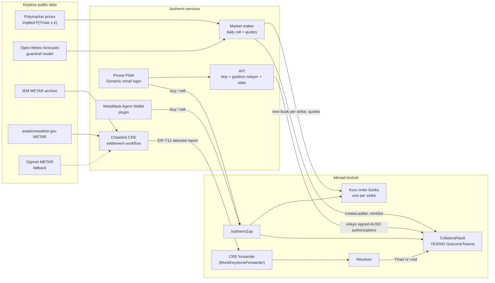

<p align="center"></p>

<h1 align="center">Isotherm</h1>

<p align="center"><b>Daily city-temperature strike ladders on Monad.</b><br>
"Will Taipei's high reach ≥ 30 °C tomorrow?" One fully collateralized YES/NO pair per strike, one onchain Kuru order book per strike, settled from the airport's METAR reports by a Chainlink CRE workflow.</p>

<p align="center">
<a href="https://isotherm.pages.dev"></a>
<a href="docs/evidence/docs-pass/forge-test-full-fork68898133.txt"></a>
<a href="script/evidence/sourcify-verify.txt"></a>
<a href="spikes/weather/RESULT.md"></a>
<a href="LICENSE"></a>
</p>

Monad Metropolis, Track 01 (Onchain Finance & Trading). Isotherm runs on Monad testnet (chain 10143) with faucet AUSD.

| | |
|---|---|
| **Phone app (PWA)** | https://isotherm.pages.dev |
| **API** (same origin) | [`/api/health`](https://isotherm.pages.dev/api/health), [`/api/snapshot`](https://isotherm.pages.dev/api/snapshot), [`/api/stats`](https://isotherm.pages.dev/api/stats), [`/api/settlements`](https://isotherm.pages.dev/api/settlements) |
| **Contracts** (Sourcify `exact_match`) | [Resolver](https://testnet.monadvision.com/address/0x9c7876Bc27df6cB473f2eaFA296FdEC22747962B) · [CollateralVault](https://testnet.monadvision.com/address/0xae36cf0a163bAfCde4D40a6Ab7b5E3C762ad7B39) · [IsothermZap](https://testnet.monadvision.com/address/0x1ACaf47987Fe570df5d136Ae1CaC0D45E2B8CFb0) · [all addresses](#contracts-and-addresses) |
| **Agent plugin** | [`packages/mm-plugin`](packages/mm-plugin/README.md): `mm weather …` for the MetaMask Agent Wallet |
| **Demo video** (≤ 3 min) · **Pitch video** (≤ 2 min) | Coming soon |
| **Design docs** | [ARCHITECTURE.md](ARCHITECTURE.md) · [docs/OPERATIONS.md](docs/OPERATIONS.md) · logo and cover in [`brand/`](brand/) |

## The problem and the product

Polymarket already trades daily high-temperature markets that resolve on a public airport weather report. Each city-day is split into 9 to 11 mutually exclusive temperature buckets, traded on an off-chain-matched order book.

Isotherm rebuilds the same risk as a **strike ladder**: for one station and one local day, a set of cumulative "Tmax ≥ k °C" strikes, each with its own onchain Kuru order book on Monad. Each strike is a complete set, 1 YES + 1 NO backed by exactly 1 AUSD, minted as plain ERC-20s. YES trades on the strike's book; NO is one tap away. A market maker quotes every book around the **Polymarket-implied probability**, and after the local day ends a **Chainlink CRE workflow** reads the station's METAR reports from two independent archives and settles the whole ladder with one attested report. Winners redeem for 1 AUSD 15 minutes later.

The vision: weather risk as composable onchain instruments. Every strike is a public book that people, contracts and agents can read and trade, with settlement anyone can recompute from public data.

## How it works



1. **Open.** From noon the day before, the roll job picks 4–6 strikes around the Polymarket-implied median, creates the ladder (two token clones per strike, one transaction), opens one Kuru YES/AUSD book per strike and registers it as the strike's canonical market in the Zap.
2. **Quote.** The maker mints inventory and quotes every book around the Polymarket-implied P(Tmax ≥ k), conditions on the day's observed METAR maximum, and pulls all quotes 10 minutes before close.
3. **Trade.** Buy YES in one transaction through the Zap; buy NO as `mintSet` + `sellYes` with an exact price bound; sell, or merge a YES+NO pair back into 1 AUSD at any time.
4. **Settle.** From 02:00 local the next day, the CRE workflow fetches every METAR and SPECI report for the local day. Two complete sources that agree produce an attested report. Disagreement or missing data stays pending with hourly retries, and voids at 0.5/0.5 only after 36 hours.
5. **Redeem.** A settled result is final after a 15-minute guardian challenge window; YES pays 1 AUSD if Tmax ≥ k, NO otherwise.

**The settlement rule** reproduces how Polymarket's daily-high markets resolve: the maximum integer °C in the METAR temperature group over all reports in the station's local day. Replayed against every Polymarket event that resolved on the same station ([`spikes/weather/RESULT.md`](spikes/weather/RESULT.md)):

| Station | Polymarket events | Isotherm rule agrees |
|---|---|---|
| Taipei Songshan (RCSS), 2026-04-05 → 10-05 | 184 | **183 / 184** (on the remaining day, two independent METAR archives both hold a 25 °C report) |
| Tokyo Haneda (RJTT), 2026-03-10 → 10-05 | 209 | **209 / 209** |

## What's live

- **Daily Taipei ladders.** The first opened on 2026-10-07 for Thu Oct 8 (≥ 28 / 29 / 30 / 31 °C): 27 transactions in 64 seconds created the ladder, four Kuru books, the maker's inventory and the opening quotes ([`createLadder`](https://testnet.monadvision.com/tx/0x84e4689412a3467bc71ec6cacb48a5b9fa7062c5e5273c1762619bff2a5e93c7), [`docs/evidence/golive/`](docs/evidence/golive/RESULT.md)). It settled automatically at 02:05 Taipei on Oct 9: high 28 °C, the same result as Polymarket's Taipei Oct 8 market ([settlement tx](https://testnet.monadvision.com/tx/0x65eee8ef9ac201c1c8155267b0e24cb1fef3c897327030705e2ebfe661d9963d)). The Oct 9 ladder has five strikes (≥ 28–32 °C).
- **Market maker** ([`packages/maker`](packages/maker)). Quotes every strike around the Polymarket-implied probability, re-quotes when fair value moves, a side fills or a quote ages, and runs an independent kill switch. A Cloudflare Durable Object port ([`apps/maker-worker`](apps/maker-worker/README.md)) runs alongside in shadow mode.
- **Settlement workflow** ([`packages/cre-workflow`](packages/cre-workflow/README.md)). TypeScript compiled to WASM, run hourly by a scheduled job with the official CRE CLI (`cre workflow simulate --broadcast`), delivering through Chainlink's MockKeystoneForwarder. Its settlement core (`settle-core.ts`) is byte-identical to the module validated in `spikes/weather` (enforced by a test), its METAR rule is the one replayed above, and it is tested on real archive captures.
- **Phone app** ([`apps/web`](apps/web/README.md)). Dynamic email sign-in with an embedded wallet, a test-funds drip, a gasless first deposit, Buy YES / Buy NO / Sell / Merge, a portfolio, redemption, and a Results screen that recovers each settlement's attestation signer in the browser. English and Traditional Chinese.
- **Agent access** ([`packages/mm-plugin`](packages/mm-plugin/README.md)). `mm weather markets | quote | edge | positions | buy | sell | redeem`, plus generic Kuru limit orders. Every write goes through the MetaMask Agent Wallet's signing service and policy.
- **API** ([`apps/api`](apps/api/README.md)). A Cloudflare Worker with a single-sender Durable Object relayer, served same-origin at `/api/*`.

## Sponsor integrations

| Sponsor | How Isotherm uses it | Onchain proof (Monad testnet) |
|---|---|---|
| **Kuru** | One Kuru v1 YES/AUSD order book per strike, created through the Kuru Router and validated by the Zap (base, quote, precision, fee cap) | Book for ≥ 28 °C created: [`0x654807ef…d480`](https://testnet.monadvision.com/tx/0x654807efc86d84d3a944796ac9c7c007849cc7cc0ac66a0904ab5aad52f2d480); opening maker quotes: [`0xb635cafc…c5da`](https://testnet.monadvision.com/tx/0xb635cafcca49fd7e8dc31bce2039f93d9d65de265a11e1c8940b17e3b52cc5da) |
| **Chainlink CRE** | Cron-triggered TypeScript workflow; the `Resolver` is a CRE `IReceiver` and accepts EIP-712-attested reports through the CRE forwarder | First live ladder settled by the official CRE CLI v1.37.0 on Monad testnet: Taipei 2026-10-08, 28 °C, matching Polymarket; two of three METAR archives agreed ([`0x65eee8ef…963d`](https://testnet.monadvision.com/tx/0x65eee8ef9ac201c1c8155267b0e24cb1fef3c897327030705e2ebfe661d9963d), [evidence](packages/cre-workflow/evidence/live-settle-RCSS-20261008.json)). Earlier: RCSS 2026-10-05 at 29 °C on the feasibility contracts ([`0x482d7a1e…817c`](https://testnet.monadvision.com/tx/0x482d7a1e5e013a3338061bf8539233b8887ddf4333ba440b59b225134c8a817c)) and RCSS + RJTT 2026-10-06 on a fork ([`sim-fork.txt`](packages/cre-workflow/evidence/sim-fork.txt)) |
| **Dynamic** | Email login with an embedded wallet, the default sign-in in the live app | Gasless deposit relayed for a Dynamic embedded wallet: [`0xca08d015…bf04`](https://testnet.monadvision.com/tx/0xca08d0150c228c16f9841b00244654ec39f96551c52a0e063584d2adabb6bf04); the same wallet's own Zap buy: [`0x361668d8…681c`](https://testnet.monadvision.com/tx/0x361668d832a2acd47180b8875c9ce44ce0ff6f7dec9a071755e7c8d9dcb4681c) |
| **MetaMask Agent Wallet** | `mm-plugin-isotherm`, an oclif plugin for `mm` 7.x; writes go through `walletExecutor`, so MetaMask's signing service and Guard policy see each transaction | Signed-in MetaMask Agent Wallet trade, 2 AUSD → 6.054545 YES ≥ 31 °C: [`0x82358f48…52ee`](https://testnet.monadvision.com/tx/0x82358f4884e1a6fc74ad56aaff7191f8855d4fa41a5de2e3a29ec932eb8152ee) ([evidence](packages/mm-plugin/evidence/signed-in/)) |
| **Agora AUSD** | The collateral: every YES+NO pair is backed by 1 AUSD. AUSD's EIP-3009 `receiveWithAuthorization` makes the first deposit gasless | [AUSD](https://testnet.monadvision.com/address/0xa9012a055bd4e0eDfF8Ce09f960291C09D5322dC); the gasless deposit above moved 5 AUSD on a signed authorization |

## Why Monad

- **A real order book for every strike.** Kuru is a fully onchain CLOB, so each strike is a book that contracts and agents can read and trade. Opening one costs 1,467,042 gas (about 0.15 testnet MON); a ladder opens 4–6 of them every day, which only makes sense where blockspace is cheap ([gas table](ARCHITECTURE.md#11-gas-and-testnet-mon-budget)).
- **Fast enough for a phone.** Blocks averaged 0.305 s over 1,000 blocks ([verification](spikes/verify/RESULT.md)); send-to-receipt had a median of 1,403 ms over the public RPC across a 56-transaction live run ([log](spikes/e2e/logs/live-2026-10-06T15-04-29/console.txt)); the go-live buy in a phone-size browser filled in 1.5 s ([go-live](docs/evidence/golive/RESULT.md)).
- **Cheap re-quotes.** A live re-quote of one strike (cancel 2 + place 2) billed 0.055–0.058 MON, so the maker can follow the market through the day.
- **Fast payout.** Redemption opens 15 minutes after the CRE report, instead of an optimistic-oracle proposal and dispute period.

## Contracts and addresses

Source of truth: [`deployments/testnet.json`](deployments/testnet.json). v1, deployed 2026-10-07 at block 68,884,377; Solidity 0.8.37. All four are Sourcify `exact_match` on `sourcify-api-monad.blockvision.org` and `sourcify.dev`.

| Contract | Monad testnet (10143) |
|---|---|
| Resolver (CRE `IReceiver`) | [`0x9c7876Bc27df6cB473f2eaFA296FdEC22747962B`](https://testnet.monadvision.com/address/0x9c7876Bc27df6cB473f2eaFA296FdEC22747962B) |
| CollateralVault + StrikeFactory | [`0xae36cf0a163bAfCde4D40a6Ab7b5E3C762ad7B39`](https://testnet.monadvision.com/address/0xae36cf0a163bAfCde4D40a6Ab7b5E3C762ad7B39) |
| IsothermZap | [`0x1ACaf47987Fe570df5d136Ae1CaC0D45E2B8CFb0`](https://testnet.monadvision.com/address/0x1ACaf47987Fe570df5d136Ae1CaC0D45E2B8CFb0) |
| OutcomeToken implementation (each YES/NO is an EIP-1167 clone) | [`0x5EfaB33DDad0715b66f514Fe12d78Ca23f3e31fC`](https://testnet.monadvision.com/address/0x5EfaB33DDad0715b66f514Fe12d78Ca23f3e31fC) |
| AUSD (Agora, testnet) · AUSD faucet | `0xa9012a055bd4e0eDfF8Ce09f960291C09D5322dC` · `0xd236c18D274E54FAccC3dd9DDA4b27965a73ee6C` |
| Kuru v1 Router · MarginAccount | `0x7EFbE105Ca7415dE98F96622173458ac1c054630` · `0xd029C2D98ff85D8F64799017fE00a59B1159CE02` |
| CRE MockKeystoneForwarder (active) · KeystoneForwarder | `0xB9F79d863261869B234c481D1f9A7af84AeAd192` · `0xF8344CFd5c43616a4366C34E3EEE75af79a74482` |

Kuru books of the RCSS 2026-10-08 ladder: ≥ 28 [`0x171b…DBd7`](https://testnet.monadvision.com/address/0x171b4cdE3724f2F17576439e6de8c36142A7DBd7), ≥ 29 [`0x855e…c6c2`](https://testnet.monadvision.com/address/0x855eF3549eA5ACA5602EAefDD988950f16FCc6c2), ≥ 30 [`0x702A…36DC`](https://testnet.monadvision.com/address/0x702A7a87EDb18D733c624bF766020F3b66eb36DC), ≥ 31 [`0x4f5E…5813`](https://testnet.monadvision.com/address/0x4f5Ef4Bf256BDD88492C1e394B0D0f06A8265813). Token addresses and seriesIds: [docs/OPERATIONS.md](docs/OPERATIONS.md#1-what-is-live).

## Repository layout

```
src/ test/ script/      Solidity contracts, Foundry tests (unit, fuzz, invariant, fork, security), deploy and e2e scripts
deployments/            testnet.json: every address, role and parameter
packages/forecast/      METAR sources, the settlement rule, Polymarket-implied fair values, guardrail model
packages/maker/         Market maker and daily ladder roll
packages/cre-workflow/  Chainlink CRE settlement workflow (TypeScript → WASM)
packages/mm-plugin/     MetaMask Agent Wallet plugin
packages/abi/           ABIs exported from forge
apps/web/               Phone PWA (Vite + React + viem, Dynamic)
apps/api/               Cloudflare Worker: drip, gasless relayer, snapshot, stats
apps/maker-worker/      The market maker as a Cloudflare Worker + Durable Object
docs/  brand/  spikes/  Runbook and evidence, logo and cover, feasibility spikes from 2026-10-06
```

## Quick start

Requirements: Node 22.18+ (it runs the `.ts` sources directly) and Foundry. The CRE workflow also needs `bun` and the CRE CLI v1.37.0, which `packages/cre-workflow/setup.sh` installs at pinned versions (the CLI download is checksum-verified); the script targets macOS arm64, and on other platforms the CLI is installed by hand. Keys live outside the repo (`~/.config/isotherm/`, one file per role); never commit them.

```bash
forge build && forge test                                                       # offline suite (fork tests skip)
MONAD_TESTNET_RPC=https://testnet-rpc.monad.xyz FORK_BLOCK=68898133 forge test  # full suite: 149 tests in 18 suites
(cd packages/forecast && npm test && npm run settle -- RCSS 2026-10-04 2026-10-05)   # recompute days from public archives
(cd packages/maker && npm ci && npm test)
(cd packages/maker && node src/cli.ts preflight --station RCSS --date tomorrow)   # operator command: read-only, needs the maker key file
(cd apps/web && npm ci && npm test && npm run dev)                 # http://127.0.0.1:5173
(cd apps/api && npm ci && npm test)                                # npm run test:fork: anvil-fork integration tests
(cd packages/mm-plugin && npm ci && npm run build && npm test)
cd packages/cre-workflow && ./setup.sh && export PATH="$PWD/.tools/bin:$PWD/.tools/node_modules/.bin:$PATH"
(cd settle && bun test && bun run build)                           # unit + golden tests, WASM build
```

Deployment (`script/deploy-testnet.sh`, testnet only), the live maker, the API and the settlement job are documented in [docs/OPERATIONS.md](docs/OPERATIONS.md) and each package's README.

## Disclosures

**Built with AI coding tools: Claude Code (Anthropic).** Ted Chen chose the idea, directed the work and made the product decisions; Claude Code wrote most of the code, tests, scripts, documentation and the logo under that direction. Commits made with Claude Code carry a `Co-Authored-By: Claude` trailer.

**Originality.** All code was written during the Metropolis build window (Sep 1 – Oct 13, 2026); the first commit is dated 2026-10-06. No pre-existing code from other projects is included. The only code we did not write is the third-party software below. The logo and video cover in `brand/` are original artwork made for this project.

### Third-party code

Summary in [NOTICE.md](NOTICE.md); each component keeps its own license.

| Component | License | Use |
|---|---|---|
| OpenZeppelin Contracts 5.7.0 | MIT | Vendored in `lib/`: ERC-20, EIP-2612, EIP-712, clones, SafeERC20, reentrancy guard |
| forge-std 1.17.0 | MIT or Apache-2.0 | Tests and scripts |
| Kuru v1 interfaces (Kuru-Labs/Kuru-contracts-dex-public, commit `2060bb2`) | GPL-2.0-or-later | `src/interfaces/IKuru.sol`, `spikes/kuru/src/interfaces/IKuru.sol` and `spikes/e2e/src/IsothermZap.sol` are derived from Kuru's public interfaces and carry GPL-2.0-or-later headers. `src/IsothermZap.sol` (MIT) imports that interface, so the compiled IsothermZap is distributed under GPL-2.0-or-later terms; text in [`LICENSES/GPL-2.0-or-later.txt`](LICENSES/GPL-2.0-or-later.txt). |
| Chainlink CRE TypeScript SDK 1.23.0 | BUSL-1.1 | npm dependency of the workflow |
| Chainlink CRE CLI v1.37.0; KeystoneForwarder and IReceiver | MIT | Build and run the workflow; called onchain |
| Dynamic SDK (`@dynamic-labs/*` 5.9.4, `@dynamic-labs-sdk/*` 1.38.0) | MIT (`@dynamic-labs-sdk/*`: Dynamic's terms) | Login and embedded wallet |
| MetaMask Agent Wallet `@metamask/agent-wallet` 7.x | MetaMask source-available license | Peer dependency of the plugin, not redistributed |
| viem, @noble/curves, oclif, React, Vite, zod | MIT | Libraries |

### Data sources

Attribution and terms for committed data are in [DATA-NOTICE.md](DATA-NOTICE.md).

| Source | Used for | Terms |
|---|---|---|
| Iowa Environmental Mesonet (Iowa State University) | Settlement source A, history | Free public archive; cached, low request rates |
| aviationweather.gov (NOAA / NWS Aviation Weather Center) | Settlement source B | U.S. government data; API usage limits observed |
| Ogimet | Settlement fallback | Queried gently, at most once per workflow run |
| Open-Meteo | Guardrail forecast model, shown as "Model" in the app | [Weather data by Open-Meteo.com](https://open-meteo.com/), [CC BY 4.0](https://creativecommons.org/licenses/by/4.0/); values are bias-corrected and combined (modified). Free API for non-commercial use |
| Polymarket public Gamma and CLOB APIs | Reference fair value; fidelity check | Read-only public market data under Polymarket's Terms of Use; Isotherm is not affiliated with Polymarket |

## License

MIT, see [LICENSE](LICENSE). Files derived from Kuru's public contracts and the compiled IsothermZap are GPL-2.0-or-later as described above; third-party code and data keep their own terms ([NOTICE.md](NOTICE.md), [DATA-NOTICE.md](DATA-NOTICE.md)).

Built by Ted Chen.
