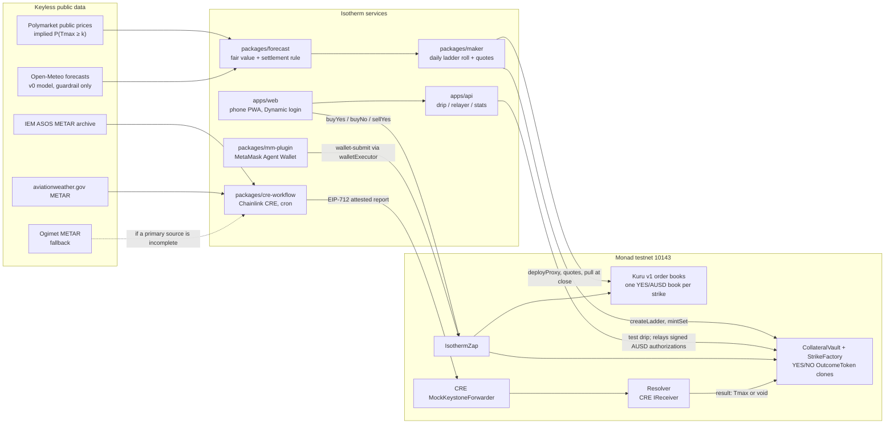

# Isotherm

**Daily city-temperature strike ladders on Monad.** "Will Taipei's high reach ≥ 28 °C tomorrow?" Each strike is a fully collateralized YES/NO token pair, YES trades on its own Kuru order book, and a Chainlink CRE workflow settles it from the same airport METAR station that Polymarket resolves on.

> **Testnet only.** Everything runs on Monad testnet (chain 10143) with faucet AUSD, which has no monetary value. Isotherm is a Monad Metropolis hackathon entry (Track 01, Onchain Finance & Trading). It is not affiliated with Polymarket, Kalshi, Kuru, Chainlink, Dynamic or MetaMask, and nothing here is financial advice.

## What Isotherm is

Polymarket already trades daily high-temperature markets for dozens of cities, but each city-day is split into about 11 mutually exclusive buckets, each with its own thin book, and positions are not composable tokens. Isotherm rebuilds the same risk as a **strike ladder**: for one station and one local day, a set of "Tmax ≥ k °C" strikes. Each strike is a complete set (1 YES + 1 NO, backed by exactly 1 testnet AUSD) held in a `CollateralVault`; YES trades on its own Kuru v1 YES/AUSD order book, and NO is bought by minting a set and selling the YES leg in one transaction (`IsothermZap`). A market-maker bot quotes every book around the **Polymarket-implied probability** for that strike (our own forecast model is only a guardrail; it loses to Polymarket in backtest). After the local day ends, a Chainlink CRE workflow fetches the station's METAR reports from two independent archives, and if they agree it delivers an attested report to the `Resolver`; YES then redeems for 1 AUSD if Tmax ≥ k and NO otherwise. If the sources disagree or no report arrives, the ladder is voided and every token redeems for 0.5. The first ladder is Taipei Songshan airport (RCSS).

## Live links

| What | Link |
|---|---|
| Phone app (PWA) | `TODO(ship): https://<project>.pages.dev` |
| API (drip, relayer, stats) | `TODO(ship): https://<worker>.workers.dev` |
| Demo video (≤ 3 min) | `TODO(ship)` |
| Pitch video (≤ 2 min) | `TODO(ship)` |
| MetaMask Agent Wallet plugin | `TODO(ship): npm package name, once published` |
| Stats page (maker fills reported separately) | `TODO(ship)` |

## How it works



A city-day in five steps:

1. **Open.** The daily roll job centres 6 strikes on the forecast, calls `createLadder(station, date, strikes, closeTime)` (12 token clones in one transaction) and creates one Kuru YES/AUSD book per strike through the Kuru v1 Router.
2. **Quote.** The maker mints complete sets for inventory and quotes bid/ask on every book around the Polymarket-implied P(Tmax ≥ k). It re-quotes only strikes whose fair value moved, sizes quotes from free margin, and pulls all quotes before `closeTime`.
3. **Trade.** Users log in with email (Dynamic embedded wallet), get a test drip, and buy YES, buy NO or sell YES through the Zap. Exits before settlement: sell YES, or merge a YES+NO pair back into 1 AUSD (`redeemSet`, never paused).
4. **Settle.** At D+1 02:00 local, the CRE workflow reads which ladders are due, fetches the day's METAR and SPECI reports from IEM and aviationweather.gov, and applies the settlement rule below. If both sources are complete and agree, it signs an EIP-712 `Settlement` and writes a report through the CRE forwarder to `Resolver.onReport`. One report settles the whole ladder.
5. **Redeem.** A settled result becomes final after a short guardian challenge window (15 minutes by default in v1), during which the guardian can only turn it into a void. Then `redeem` pays 1 AUSD per winning token. A void pays 0.5 per token and is final at once. If no report arrives within 48 hours of the day's end, anyone can void the ladder.

The full design, trust model and failure modes are in [ARCHITECTURE.md](ARCHITECTURE.md).

## The settlement rule and how faithful it is

```
Tmax(station, D) = max integer °C from the METAR temperature group "TT/DD" (M = minus)
                   over all METAR and SPECI reports with obsTime in [D 00:00 local, D+1 00:00 local)
                   RCSS = UTC+8, RJTT = UTC+9, no DST
YES(k) pays 1 AUSD iff Tmax ≥ k.  Void pays 0.5 / 0.5.
```

We replayed this rule against every Polymarket daily-high event that resolved on the same station (`spikes/weather/RESULT.md`, `node scripts/fidelity.ts`):

| Station | Station-sourced events | Our rule matches Polymarket | On-cycle reports only | Hourly reports only | UTC day instead of local |
|---|---|---|---|---|---|
| RCSS Taipei (2026-04-05 → 10-05) | 184 | **183 / 184** | 180 / 184 | 155 / 184 | 171 / 184 |
| RJTT Tokyo (2026-03-10 → 10-05) | 209 | **209 / 209** | 209 / 209 | 182 / 209 | 185 / 209 |

- The one miss, RCSS 2026-05-04, resolved as 24 °C on Polymarket. The routine report `RCSS 040530Z … 25/18` is present in both IEM and Ogimet, so the archives say the high was 25 °C.
- SPECI and :30 reports matter: on 3 RCSS days only an off-cycle SPECI held the maximum, and on 28 days per station only the :30 report did.
- The sources agree with each other: IEM vs Ogimet 272/272 (RCSS) and 218/218 (RJTT) complete days; IEM vs aviationweather.gov 19/19 per station; 885/885 and 960/960 time-matched reports carry the same temperature.
- One source is not enough: IEM's RCSS archive had a 158-day gap (2025-09-17 → 2026-02-21). That is why the workflow uses two primary sources plus a fallback, and voids rather than guesses.

## What is proven so far

All evidence below is from commands we ran; logs are in the linked folders. "Ours" means every wallet involved belongs to the team: these are test transactions, **not traction**.

| Claim | Evidence |
|---|---|
| The full loop runs on **live Monad testnet**: deploy → ladder → maker mints and quotes on 3 new Kuru books → book buy, Zap buy-NO and Zap buy-YES → re-quote → pull quotes at close → attested report via the real `MockKeystoneForwarder` → replay rejected → void ladder → redeem | **56 / 56 transactions succeeded**, 2.6841 MON billed, median send→receipt latency **1,403 ms** (769–3,063 ms) over the public RPC, 2026-10-06 15:04 UTC. Uses a throwaway test station `ZZZZ` whose local day ended 25 minutes after launch, with a scripted Tmax of 29 °C. `spikes/e2e/logs/live-2026-10-06T15-04-29/` |
| Our own `OutcomeToken` clones trade on live Kuru v1 books | Books `0x900793BD…14beB`, `0x0a75Aff5…B5196`, `0xe83dD9a3…224b` in the run above; taker market buy [`0x59c125b2…88d9`](https://testnet.monadvision.com/tx/0x59c125b2bb41cc7e525561877b69cf7eb013276d8fb5dc7bf52c0efbecd988d9) |
| A real Taipei day settles from live METAR through CRE | RCSS 2026-10-05 settled at **29 °C** (SDK test harness, tx [`0x482d7a1e…817c`](https://testnet.monadvision.com/tx/0x482d7a1e5e013a3338061bf8539233b8887ddf4333ba440b59b225134c8a817c)); RCSS 2026-10-04 settled at **35 °C** by the CRE simulator engine running our compiled WASM with `--broadcast` (tx [`0x999c2cce…ca29`](https://testnet.monadvision.com/tx/0x999c2cce489beeba14a21899adb87b807f014b30608c16ebd579de5d77a8ca29)). Both match Polymarket's resolved highs. The simulator binary was built from the MIT CRE CLI source with only the login check removed; the unmodified `cre workflow simulate` needs a CRE login (`spikes/cre/RESULT.md` §6) |
| Contracts are tested | Feasibility tree: 115 tests in 14 suites pass on a pinned fork (v1: `TODO(ship)` count) (unit, 1,000-run fuzz, invariants, live-state fork tests, adversarial tests); injected-bug checks caught 7/7 (core) and 6/6 (security) mutants (`script/RESULT.md`, `test/security/RESULT.md`) |
| Independent verification | A separate agent re-ran every critical claim from a clean shell on its own forks (`spikes/verify/RESULT.md`) |
| A forecast record without hindsight | **Not yet.** The mainnet `ForecastCommit` contract is written and simulated, not deployed (needs mainnet MON). `TODO(ship)` |

## Why Monad (measured, not assumed)

Weather data arrives every 30–60 minutes, so we do not claim Isotherm needs thousands of updates a second. What is specific to Monad:

- **A real onchain order book per strike.** Kuru is a fully onchain CLOB, so every strike is a book that other contracts and agents can read and trade. A 6-strike ladder means 6 books per city per day; creating each costs 1,467,042 gas (0.1496 MON on testnet), which is only sensible where gas is cheap.
- **Fast re-quotes.** Blocks averaged 0.305 s over 1,000 blocks. On the live run, send→receipt took a median of 1,403 ms over the public RPC. A full-ladder re-quote (cancel 2 + place 2 per strike) costs about 0.5M gas per strike.
- **Fast payout.** Redemption opens minutes after the CRE report: v1 has a fixed guardian challenge window (15 minutes by default) instead of an optimistic-oracle proposal and dispute process. In the feasibility build, which had no challenge window, the first redemption landed 20 blocks after the report.
- **Honest caveats.** The contracts would run on any fast EVM. Monad bills the **gas limit**, not gas used, so every transaction is estimated first and sent with a 1.05–1.10× limit. Measured cost of one 6-strike city-day with hourly re-quotes: 9.842 MON on testnet, 78% of it re-quoting.

## Contracts and testnet addresses

`TODO(ship): fill from deployments/testnet.json, the single source of truth, once the v1 deployment exists.`

| Contract | Address (Monad testnet 10143) |
|---|---|
| Resolver | `TODO(ship)` |
| CollateralVault (+ StrikeFactory) | `TODO(ship)` |
| IsothermZap | `TODO(ship)` |
| OutcomeToken implementation | `TODO(ship)` |
| ForecastCommit (Monad mainnet 143) | `TODO(ship)`, not deployed yet |

Feasibility deployment (2026-10-06; pre-review bytecode, kept as evidence and replaced by v1):

| Contract | Address |
|---|---|
| Resolver | [`0x1c7a8a5df93f7f33c778c2163d8887e9249475f1`](https://testnet.monadvision.com/address/0x1c7a8a5df93f7f33c778c2163d8887e9249475f1) |
| CollateralVault | [`0xc83fe722eb5bd29a0355c090f14ccb0605153713`](https://testnet.monadvision.com/address/0xc83fe722eb5bd29a0355c090f14ccb0605153713) |
| IsothermZap | [`0x1b1d91ebd1590c7814aedcae66ac6ded492c792e`](https://testnet.monadvision.com/address/0x1b1d91ebd1590c7814aedcae66ac6ded492c792e) |
| CRE spike Resolver | [`0xb7b91d408f74f4e5c444c75981208ca78e2bca09`](https://testnet.monadvision.com/address/0xb7b91d408f74f4e5c444c75981208ca78e2bca09) |

External contracts we use:

| Contract | Address |
|---|---|
| Testnet AUSD (6 decimals; EIP-712 domain "Agora Dollar" v1) | `0xa9012a055bd4e0eDfF8Ce09f960291C09D5322dC` |
| AUSD faucet (`requestFunds`, 10,000 AUSD, one 60 s cooldown shared by all callers) | `0xd236c18D274E54FAccC3dd9DDA4b27965a73ee6C` |
| Kuru v1 Router | `0x7EFbE105Ca7415dE98F96622173458ac1c054630` |
| Kuru MarginAccount | `0xd029C2D98ff85D8F64799017fE00a59B1159CE02` |
| Chainlink CRE MockKeystoneForwarder (simulation) | `0xB9F79d863261869B234c481D1f9A7af84AeAd192` |
| Chainlink CRE KeystoneForwarder (production) | `0xF8344CFd5c43616a4366C34E3EEE75af79a74482` |

## Repository layout

```
src/                 Solidity: OutcomeToken, StrikeFactory, CollateralVault, Resolver, ForecastCommit, lib/StationTime
test/                Foundry tests: unit, fuzz, invariant, fork, integration, security
script/              Deploy scripts, e2e scripts, evidence
deployments/         testnet.json: the one source of truth for addresses
packages/abi/        ABIs exported from forge
packages/forecast/   Weather sources, Polymarket-implied fair value, settlement rule
packages/maker/      Market maker and daily ladder roll
packages/cre-workflow/  Chainlink CRE settlement workflow (TypeScript → WASM)
packages/mm-plugin/  MetaMask Agent Wallet (mm) plugin
apps/web/            Phone PWA (Dynamic login, embedded wallet)
apps/api/            Cloudflare Worker: drip / relayer and stats API
docs/                Operations runbook and evidence
spikes/              Feasibility spikes from 2026-10-06, kept unchanged as evidence
```

Each package is its own npm project (no workspaces). Shared values come from `deployments/testnet.json` and `packages/abi/*.json`.

## Setup and run

Requirements: Node 22, Foundry 1.8.5 (`export PATH="$PATH:$HOME/.foundry/bin"`), and for the CRE workflow `bun` and the CRE CLI v1.37.0. Keys live outside the repo, one hex key per file in `~/.config/isotherm/` (chmod 600); never commit them.

`TODO(ship): check every command below against each package's package.json before submission.`

**Contracts**

```bash
forge build
forge test                                                                    # fork tests skip without the env var
MONAD_TESTNET_RPC=https://testnet-rpc.monad.xyz FORK_BLOCK=68693965 forge test # full suite, pinned fork
```

Deploy to testnet (refuses chain 143). Use separate keys for owner, guardian, attester and operator:

```bash
ATTESTER=<attester address> OPERATOR=<maker address> GUARDIAN=<guardian address> NEW_OWNER=<owner address> \
forge script script/Deploy.s.sol --rpc-url monad_testnet --broadcast \
  --private-key "$(cat ~/.config/isotherm/deployer.key)" --gas-estimate-multiplier 110 --slow
```

Full loop on live testnet with throwaway stations (about 20–30 minutes, about 3.7 MON across four wallets): `script/testnet-e2e.sh`. Rehearse it first on an anvil fork: `anvil --fork-url https://testnet-rpc.monad.xyz --port <port>` detects Monad's rules automatically.

**Forecast and settlement rule** (`packages/forecast`, zero runtime dependencies, Node 22 runs the `.ts` files directly):

```bash
cd packages/forecast
npm test
npm run settle -- RCSS 2026-10-04 2026-10-05   # recompute any day from the public archives: SETTLED / PENDING / VOID per source
npm run ladder                                  # today's Polymarket-implied ladder (TODO(ship): confirm arguments)
```

**Market maker and daily roll** (`packages/maker`): `npm ci && npm test`, then `npm run maker -- <command>`; see `packages/maker/README.md` for the dry-run, quote and roll commands (`TODO(ship)`). It reads addresses from `deployments/testnet.json`, its settings from `packages/maker/config/default.json` (gas multipliers, daily MON caps, quote spread) and role keys from `~/.config/isotherm/`.

**Web app** (`apps/web`, Vite + React, Dynamic React SDK):

```bash
cd apps/web && npm ci
VITE_DYNAMIC_ENVIRONMENT_ID=<sandbox environment id> VITE_API_URL=<api url> npm run dev   # http://localhost:5173
```

The Dynamic environment needs Monad Testnet enabled and the app's origin in its CORS list. A login button that spins forever means the environment ID is missing or wrong.

**API** (`apps/api`, Cloudflare Worker with a Durable Object relayer and KV): `cd apps/api && npm ci && npm test && npm run dev` (wrangler 3, port 8781). The relayer key is a Worker secret (`RELAYER_KEY`), never a file in the repo. Deploy with `npm run deploy` after creating the KV namespace (`TODO(ship)`: exact steps from `apps/api/RESULT.md`).

**CRE workflow** (`packages/cre-workflow`; `TODO(ship)`: confirm folder and target names): `cre login` once (browser + 2FA), then

```bash
cre workflow build ./settle                    # no login needed
cre workflow simulate ./settle -T testnet --non-interactive --trigger-index 0 --broadcast
```

Treat `ReportProcessed(result=false)` as a failure: both forwarders swallow a reverting `onReport`, so a successful transaction does not mean the ladder settled. Check `LadderResolved` or `Resolver.resultOf`.

**MetaMask Agent Wallet plugin**: needs `@metamask/agent-wallet` 7.x, `mm login` and `mm init`. Then:

```bash
cd packages/mm-plugin && npm ci && npm run build && npm test
mm config set experimentalPlugins true
mm config set experimentalAllowUnverifiedInstalls true
mm plugins install <tarball URL> --accept-permissions   # installing by npm name uninstalls itself in 7.0.0
# add Monad testnet to mm (MetaMask's RPC gateway rejects 10143): TODO(ship) setup script path
mm weather markets --json
mm weather quote taipei --json
```

## Competitors and where Isotherm fits

| | What it is | Difference |
|---|---|---|
| Polymarket daily city highs | Off-chain-matched books, ~11 mutually exclusive buckets per city-day, optimistic-oracle resolution | Isotherm: "≥ k" strikes as ERC-20s, one onchain book per strike, redemption minutes after the CRE report. Same station rule. Isotherm uses Polymarket's public prices as its quoting reference |
| Kalshi international temperature contracts | CFTC-regulated venue; per our Oct 2026 research, contracts for Asian cities were self-certified in Dec 2025 but no events are listed (`TODO(verify)` before submission) | Regulated and centralized; Isotherm is a testnet prototype |
| hunch-book (Metropolis) | General prediction markets that graduate from pools to Kuru books | Same complete-set mechanics. Isotherm is narrow: station-exact settlement with void rules, a weather fair-value maker, and a public fidelity table |
| Covenant (Metropolis) | Vault-enforced market-maker mandates on Kuru | Market-making infrastructure, not a new asset class |

## Limitations and risks (honest)

- **Testnet, faucet money.** AUSD here is worthless, so fills carry no profit or loss and outside traders have little reason to show up. Maker fills are always reported separately from non-maker fills, the maker never trades against its own quotes, and there is no subsidised volume.
- **No forecasting edge.** Our v0 model (Open-Meteo, bias-corrected) has a pooled Brier score of 0.0656 against Polymarket's 0.0594 at 23:00 the night before (381 station-days; the 95% CI of the difference is +0.0030 to +0.0092). That is why the maker quotes around Polymarket's implied probabilities. Polymarket's prices are hourly last prints, which can be stale in the tails.
- **Settlement trust.** In simulation mode the CRE forwarder is permissionless, so the real authentication is the EIP-712 attestation from a single attester key. The guardian's challenge window can turn a wrong result into a refund (void), but not into a different winner. Production CRE (DON signatures, workflow-ID pinning) needs CRE deploy access from Chainlink (`TODO(ship)`: requested on … / status).
- **Security findings.** The review in `test/security/RESULT.md` found no critical issue and 7 medium ones (stale-void timing, the CRE void policy, the Zap accepting a second hostile book for the same YES token, maker quotes left open after close, guardian power to force a void, the single hot attester key, and attestation-off ordering). How v1 addresses each is in [ARCHITECTURE.md §13](ARCHITECTURE.md#13-security-review-status) (`TODO(ship)`: add the v1 test names).
- **Isotherm cannot pause a Kuru book.** Books are owned by Kuru's Router. The maker must pull its quotes before close, because the day's maximum becomes public through METAR hours before settlement.
- **Gas budget.** Monad bills the gas limit. One 6-strike city-day with hourly re-quotes measured 9.842 MON on testnet, and testnet MON is scarce. Re-quoting only strikes that moved brings this to about 5.98 MON.
- **Data dependencies.** IEM, aviationweather.gov and Ogimet are free services with no SLA; aviationweather.gov keeps only recent days. Open-Meteo's free API is for non-commercial use only.
- **Not audited.** No external audit. Static lints were reviewed.
- **Regulation.** Event contracts are restricted in many jurisdictions, including Taiwan, where the team is based. Isotherm will not offer real-money markets to retail users without legal advice. The commercial path is calibrated data for traders and hedges sold through licensed partners.

## Disclosures

### Built with AI coding tools

**Built with AI coding tools: Claude Code (Anthropic).** Ted Chen chose the idea, made the product and risk decisions, and reviewed the output. Claude Code wrote most of the code, tests, scripts and documentation. In practice:

- Parallel Claude Code agents built one feasibility spike each (Kuru, weather, CRE, MetaMask plugin, Dynamic, end-to-end) and reported what worked with command output.
- A separate Claude Code agent independently re-ran every claim (`spikes/verify/RESULT.md`), and another ran a security review with adversarial tests (`test/security/RESULT.md`).
- Product packages were then built by agents, each owning one folder.
- Commits made with Claude Code carry a `Co-Authored-By: Claude` trailer.

### Originality: no pre-existing code

All Isotherm code was written from 2026-10-06 onward, inside the Metropolis build window (2026-09-01 → 2026-10-13). The first commit is dated 2026-10-06 15:03 UTC, and the earliest file timestamp in the source tree is 2026-10-06 12:46 UTC (vendored libraries excluded). No code from earlier projects is included. The only code we did not write is the third-party software listed below.

### Third-party code

| Component | License | Where and how it is used |
|---|---|---|
| OpenZeppelin Contracts 5.7.0 | MIT | Vendored in `lib/openzeppelin-contracts` (trimmed to `contracts/`): ERC-20, EIP-2612, EIP-712, clones, SafeERC20, reentrancy guards |
| forge-std 1.17.0 | MIT or Apache-2.0 | `lib/forge-std`, tests and scripts only |
| Kuru v1 contract interfaces and ABIs | GPL-2.0-or-later (Kuru-Labs/Kuru-contracts-dex-public, commit `2060bb2`) | `spikes/kuru/src/interfaces/IKuru.sol` is derived from Kuru's public contracts and keeps its GPL-2.0-or-later header. The product uses a minimal interface for the few functions it calls (`src/interfaces/IKuru.sol`, MIT header; `TODO(ship)`: confirm it was written from the checked selectors, not copied from the GPL source, or relabel it GPL-2.0-or-later). `@kuru-labs/kuru-sdk` 0.0.95 (ISC) was used in the spike for ABI reference |
| Chainlink CRE TypeScript SDK `@chainlink/cre-sdk` 1.23.0 | BUSL-1.1 (non-production use; changes to MIT on 2029-05-20) | npm dependency of the CRE workflow, not vendored |
| Chainlink CRE CLI v1.37.0 | MIT | Build and simulate the workflow; installed from the checksum-verified GitHub release |
| Chainlink KeystoneForwarder / MockKeystoneForwarder / IReceiver | MIT (chainlink-evm) | Called on chain; our `IReceiver` interface follows Chainlink's |
| Dynamic SDK: `@dynamic-labs/sdk-react-core`, `@dynamic-labs/ethereum` 5.9.4; `@dynamic-labs-sdk/*` 1.38.0; `@dynamic-labs-wallet/node-evm` 1.1.29 | MIT (the `@dynamic-labs-sdk/*` packages declare no license field; see Dynamic's terms) | Login, embedded wallet, typed-data signing, server wallet |
| MetaMask Agent Wallet `@metamask/agent-wallet` 7.x | MetaMask source-available license (inspect and study only) | `peerDependency` of the plugin; not redistributed |
| viem, @noble/curves, oclif, React, Vite, zod | MIT | Libraries |

### Data sources and their terms

| Source | Used for | Terms |
|---|---|---|
| Iowa Environmental Mesonet (Iowa State University), ASOS METAR archive | Settlement source A, history | Free public archive; we cache responses and keep request rates low |
| aviationweather.gov Data API (NOAA / NWS Aviation Weather Center) | Settlement source B (recent days only) | US government public data; observe the API's usage limits |
| Ogimet | Settlement fallback C | Free service that asks for gentle use; not called by every node on every run |
| Open-Meteo | v0 forecast model (guardrail) | Data CC BY 4.0, "Weather data by Open-Meteo.com"; the free API is for non-commercial use, so a commercial product needs a paid plan |
| Polymarket public Gamma and CLOB price-history APIs | Reference fair value; fidelity check against resolved events | Read-only public market data, subject to Polymarket's Terms of Use. Isotherm sends no orders to Polymarket and is not affiliated with it |

## License

MIT, see [LICENSE](LICENSE). Files derived from Kuru's public contracts keep their GPL-2.0-or-later headers, and third-party code keeps its own license.
