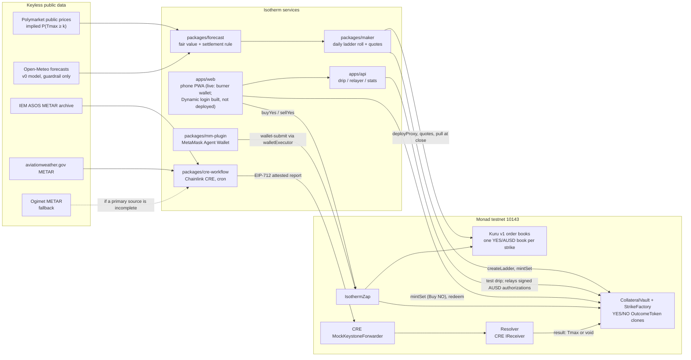

# Isotherm


**Daily city-temperature strike ladders on Monad.** "Will Taipei's high reach ≥ 28 °C tomorrow?" Each strike is a fully collateralized YES/NO token pair, YES trades on its own Kuru order book, and a Chainlink CRE workflow settles it from the same airport METAR station that Polymarket resolves on.

> **Testnet only.** Everything runs on Monad testnet (chain 10143) with faucet AUSD, which has no monetary value. Isotherm is a Monad Metropolis hackathon entry (Track 01, Onchain Finance & Trading). It is not affiliated with Polymarket, Kalshi, Kuru, Chainlink, Dynamic or MetaMask, and nothing here is financial advice.

## What Isotherm is

Polymarket already trades daily high-temperature markets for dozens of cities, but each city-day is split into about 11 mutually exclusive buckets, each with its own thin book, and positions are not composable tokens. Isotherm rebuilds the same risk as a **strike ladder**: for one station and one local day, a set of "Tmax ≥ k °C" strikes. Each strike is a complete set (1 YES + 1 NO, backed by exactly 1 testnet AUSD) held in a `CollateralVault`. YES trades on its own Kuru v1 YES/AUSD order book through `IsothermZap`; NO is bought by minting a set and selling the YES leg with a minimum-proceeds bound. A market-maker bot quotes every book around the **Polymarket-implied probability** for that strike (our own forecast model is only a guardrail; it loses to Polymarket in backtest). After the local day ends, a Chainlink CRE workflow fetches the station's METAR reports from two independent archives, and if they agree it delivers an attested report to the `Resolver`; YES then redeems for 1 AUSD if Tmax ≥ k and NO otherwise. If the sources disagree or no report arrives, the ladder is voided and every token redeems for 0.5. The first ladder is Taipei Songshan airport (RCSS).

## Live links

| What | Link |
|---|---|
| Phone app (PWA) | https://isotherm.pages.dev |
| API (drip, gasless-mint relayer, maker snapshot, stats) | <former API host> (`/api/health`, `/api/snapshot`, `/api/stats`, `/api/settlements`) |
| First live ladder | Taipei Songshan (RCSS), Thu 2026-10-08, strikes ≥ 28 / 29 / 30 / 31 °C, trading closes 17:30 Taipei. Opened 2026-10-07 13:55 Taipei by [`createLadder`](https://testnet.monadvision.com/tx/0x84e4689412a3467bc71ec6cacb48a5b9fa7062c5e5273c1762619bff2a5e93c7) |
| Settlement of that ladder | From 02:05 Taipei on Oct 9 (2026-10-08 18:05 UTC), hourly, by a launchd job running the CRE workflow. The team logged in to CRE on 2026-10-07, so the job now runs the unmodified CRE CLI (`cre workflow simulate --broadcast`); its first official run against live testnet, at 08:05 UTC, found nothing due yet and sent no report. If the CRE session lapses, the job falls back to the labelled SDK-harness path (same handler and attestation, not the CRE engine), and each run's evidence record names the path. [docs/OPERATIONS.md §6](docs/OPERATIONS.md#6-settlement-not-run-by-the-maker) |
| Contracts (v1, Sourcify `exact_match`) | [table below](#contracts-and-testnet-addresses) |
| Demo video (≤ 3 min) | Not published yet; linked here once recorded |
| Pitch video (≤ 2 min) | Not published yet; linked here once recorded |
| MetaMask Agent Wallet plugin | `mm-plugin-isotherm` 0.1.0 in [`packages/mm-plugin`](packages/mm-plugin/README.md); not on npm yet |
| Logo and video cover | [`brand/`](brand/) |

**Login.** The live app offers a clearly labelled **testnet burner wallet** ("Dev wallet", kept in the browser) plus a "Get test funds" drip; Dynamic is not enabled in the deployed build. A Dynamic Sandbox environment now exists (email login, embedded wallet created at sign-up), and web builds from this tree make "Sign in with email" through Dynamic the default, with the dev wallet as a fallback. On localhost, Dynamic's SDK loads that environment and its login modal renders, but nobody has logged in yet, so no Dynamic wallet has signed anything. That build will not be deployed until a person signs in with a Dynamic test account and the embedded wallet completes a relayed mint and a Buy Yes on testnet. Monad Testnet is also not yet enabled in the environment's dashboard (public settings at 08:40 UTC list only Ethereum Mainnet); the app adds 10143 itself through `overrides.evmNetworks`, untested with a logged-in wallet (`apps/web/evidence/dynamic/RESULT.md`).

**Stats.** `/api/stats` counts distinct non-maker wallets, non-maker fills and settled city-days from our own log scan. Maker and team wallets are excluded, including our own go-live smoke test.

## How it works



A city-day in five steps:

1. **Open.** The daily roll job picks 4–6 consecutive strikes around the **Polymarket-implied median** for the city-day, calls `createLadder(station, date, strikes, closeTime)` (two token clones per strike in one transaction), creates one Kuru YES/AUSD book per strike through the Kuru v1 Router, and registers each book as the strike's canonical market in the Zap. The live Oct 8 ladder has 4 strikes (≥ 28–31 °C) around a Polymarket median of 29 °C.
2. **Quote.** The maker mints complete sets for inventory and quotes bid/ask on every book around the Polymarket-implied P(Tmax ≥ k). It re-quotes a strike only when its price should move by at least 2 ticks, a side fills, a quote is 6 hours old, or fair value crosses a resting quote. It sizes quotes from free margin and pulls every quote 10 minutes before `closeTime`.
3. **Trade.** Users get a test drip and buy YES (`Zap.buyYes`), buy NO (`vault.mintSet`, then `Zap.sellYes` of exactly that YES with a `minAusdOut` bound) or sell YES (`Zap.sellYes`). The live demo signs with the burner wallet until the Dynamic build is deployed. Exits before settlement: sell YES, or merge a YES+NO pair back into 1 AUSD (`redeemSet`, never paused).
4. **Settle.** From 02:00 local on the next day (RCSS: 18:00 UTC) the CRE workflow reads which ladders are due, fetches the day's METAR and SPECI reports from IEM and aviationweather.gov (Ogimet when one of them is incomplete) and applies the settlement rule below. If two complete sources agree, the attester signs an EIP-712 `Settlement` and the report goes through the CRE forwarder to `Resolver.onReport`. One report settles the whole ladder. Disagreement or missing data stays pending, with hourly retries; it becomes a void only after 36 hours (46-hour backstop).
5. **Redeem.** A settled result becomes final after a **15-minute guardian challenge window** (deployed `challengeWindow = 900` s), during which the guardian can only turn it into a void. Then `redeem` pays 1 AUSD per winning token. A void pays 0.5 per token and is final at once. If no report arrives within 48 hours of the day's end, anyone can void the ladder.

The full design, trust model and failure modes are in [ARCHITECTURE.md](ARCHITECTURE.md). Day-to-day operation of the live deployment is in [docs/OPERATIONS.md](docs/OPERATIONS.md).

## The settlement rule and how faithful it is

```
Tmax(station, D) = max integer °C from the METAR temperature group "TT/DD" (M = minus)
                   over all METAR and SPECI reports with obsTime in [D 00:00 local, D+1 00:00 local)
                   RCSS = UTC+8, RJTT = UTC+9, no DST
YES(k) pays 1 AUSD iff Tmax ≥ k.  Void pays 0.5 / 0.5.
```

We replayed this rule against every Polymarket daily-high event that resolved on the same station (`spikes/weather/RESULT.md`, `node scripts/fidelity.ts`):

| Station | Station-sourced events | Our rule matches Polymarket | On-cycle reports only | Hourly reports only | UTC day instead of local |
|---|---|---|---|---|---|
| RCSS Taipei (2026-04-05 → 10-05) | 184 | **183 / 184** | 180 / 184 | 155 / 184 | 171 / 184 |
| RJTT Tokyo (2026-03-10 → 10-05) | 209 | **209 / 209** | 209 / 209 | 182 / 209 | 185 / 209 |

- The one miss, RCSS 2026-05-04, resolved as 24 °C on Polymarket. The routine report `RCSS 040530Z … 25/18` is present in two independent archives, IEM and Ogimet, so the archives say the high was 25 °C.
- SPECI and :30 reports matter: on 3 RCSS days only an off-cycle SPECI held the maximum, and on 28 days per station only the :30 report did.
- The sources agree with each other: IEM vs Ogimet 272/272 (RCSS) and 218/218 (RJTT) complete days; IEM vs aviationweather.gov 19/19 per station; 885/885 and 960/960 time-matched reports carry the same temperature.
- One source is not enough: IEM's RCSS archive had a 158-day gap (2025-09-17 → 2026-02-21). That is why the workflow uses two primary sources plus a fallback, and voids rather than guesses.

## What is proven so far

All evidence below is from commands we ran; logs are in the linked folders. Every wallet involved belongs to the team: these are test transactions, **not traction**.

| Claim | Evidence |
|---|---|
| The v1 contracts are live and source-verified | Resolver, CollateralVault, IsothermZap and the OutcomeToken implementation deployed 2026-10-07 05:14 UTC; 10,315,665 gas billed at 103 gwei = 1.0625 MON. Sourcify `exact_match` on two verifiers. `deployments/testnet.json`, `script/RESULT.md`, `script/evidence/sourcify-verify*.txt` |
| A real Taipei ladder is open and quoted on live testnet | Go-live, 2026-10-07: the roll for RCSS 2026-10-08 took **27 transactions in 64 s** and billed **1.257 MON** (operator key 0.776 for the ladder, 4 Kuru books and 4 canonical-market registrations; maker 0.480 for mints, margin and quotes). Initial quotes were centred on the Polymarket-implied P(≥ k) of 0.950 / 0.840 / 0.461 / 0.092. The maker runs under launchd and re-quoted 3 strikes live. A phone smoke test bought 76.85 YES ≥ 31 °C for 10 AUSD through the Zap. All 43 go-live transactions have status `success`. `docs/evidence/golive/RESULT.md`, `live-txs.tsv`, `txs-roll.jsonl` |
| The full loop ran on live Monad testnet (feasibility build): deploy → ladder → maker mints and quotes on 3 new Kuru books → book buy, Zap buy-NO and Zap buy-YES → re-quote → pull quotes at close → attested report via the real `MockKeystoneForwarder` → replay rejected → void ladder → redeem | **56 / 56 transactions succeeded**, 2.6841 MON billed, median send→receipt latency **1,403 ms** (769–3,063 ms) over the public RPC, 2026-10-06 15:04 UTC. Uses a throwaway test station `ZZZZ` whose local day ended 25 minutes after launch, with a scripted Tmax of 29 °C. `spikes/e2e/logs/live-2026-10-06T15-04-29/` |
| Our own `OutcomeToken` clones trade on live Kuru v1 books | The 4 live books of the Oct 8 ladder (below), and in the feasibility run books `0x900793BD…14beB`, `0x0a75Aff5…B5196`, `0xe83dD9a3…224b`; taker market buy [`0x59c125b2…88d9`](https://testnet.monadvision.com/tx/0x59c125b2bb41cc7e525561877b69cf7eb013276d8fb5dc7bf52c0efbecd988d9) |
| Real city-days settled from live METAR by the CRE workflow: **v1 with the unmodified official CRE CLI on an anvil fork**, and earlier **on the live feasibility Resolver with a login-patched simulator and the SDK test harness** | **Official CLI, v1, fork.** After the team's `cre login` (2026-10-07), the official CRE CLI v1.37.0 (byte-identical to the SHA-256-pinned release zip) ran `cre workflow simulate --broadcast` against the v1 Resolver on an anvil fork of live testnet (block 68,917,527; the attester was swapped for a public test key, the real attester key was not used). It settled RCSS 2026-10-06 at **25 °C** and RJTT 2026-10-06 at **26 °C**, both matching Polymarket's resolved highs; a second run skipped both as already resolved, and replaying the first report's exact calldata was not accepted (`ReportProcessed.result=false`). These are fork transactions, not on the explorer (`packages/cre-workflow/evidence/sim-fork.txt`). **Feasibility, live testnet.** RCSS 2026-10-05 settled at **29 °C** through the CRE SDK test harness (tx [`0x482d7a1e…817c`](https://testnet.monadvision.com/tx/0x482d7a1e5e013a3338061bf8539233b8887ddf4333ba440b59b225134c8a817c)); RCSS 2026-10-04 settled at **35 °C** by the CRE simulator engine running our compiled WASM with `--broadcast` (tx [`0x999c2cce…ca29`](https://testnet.monadvision.com/tx/0x999c2cce489beeba14a21899adb87b807f014b30608c16ebd579de5d77a8ca29)), with a simulator binary built from the MIT CRE CLI source with only the login check removed (`spikes/cre/RESULT.md` §6). Both match Polymarket's resolved highs. **Live v1.** The hourly settle job has taken the official path since the login: its first official run against live testnet (2026-10-07 08:05 UTC) scanned the one ladder, found nothing due and sent no report. As of 2026-10-07 no v1 ladder had been settled; the first, RCSS 2026-10-08, is due from 2026-10-08 18:05 UTC, and each settlement run's evidence record names the path it used (official CRE CLI or SDK-harness fallback) |
| Contracts are tested | **149 tests in 18 suites pass, 0 fail, 0 skipped**, on a fork pinned at block 68,898,133: the 134 v1 tests plus 15 from the v1 security review (unit, 1,000-run fuzz, 2 invariant suites, live-state fork tests including the deployed v1 addresses, adversarial tests). Offline, 139 pass and the 10 fork tests skip. Injected-bug checks: **22 / 22** v1 mutants caught (`script/RESULT.md`), plus 5 / 5 more in the v1 review (`test/security/v1/evidence/mutation-v1-tests.txt`). Logs: `docs/evidence/docs-pass/forge-test-full-fork68898133.txt`, `test/security/v1/evidence/forge-test-full-fork68898133.txt` |
| Independent verification and security reviews | A separate agent re-ran every feasibility claim from a clean shell (`spikes/verify/RESULT.md`); adversarial reviews of the feasibility contracts (`test/security/RESULT.md`) and of the v1 diff and API (`test/security/v1/RESULT.md`) |
| A forecast record without hindsight | **Not yet.** The mainnet `ForecastCommit` contract is written and tested, not deployed (needs mainnet MON). |

## Why Monad (measured, not assumed)

Weather data arrives every 30–60 minutes, so we do not claim Isotherm needs thousands of updates a second. What is specific to Monad:

- **A real onchain order book per strike.** Kuru is a fully onchain CLOB, so every strike is a book that other contracts and agents can read and trade. A ladder means one book per strike per city per day; creating each costs 1,467,042 gas (0.1496 MON on testnet, measured again for all 4 live books at go-live), which is only sensible where gas is cheap.
- **Fast re-quotes.** Blocks averaged 0.305 s over 1,000 blocks. Send→receipt took a median of 1,403 ms over the public RPC in the feasibility run and 1.0–1.5 s per transaction in the go-live roll. One live re-quote of a strike (cancel 2 + place 2) billed 0.055–0.058 MON (536,884–567,427 gas).
- **Fast payout.** Redemption opens 15 minutes after the CRE report (the guardian challenge window), instead of an optimistic-oracle proposal and dispute process. In the feasibility build, which had no challenge window, the first redemption landed 20 blocks after the report.
- **Honest caveats.** The contracts would run on any fast EVM. Monad bills the **gas limit**, not gas used, so every transaction is estimated first and the limit is set from the estimate. A 6-strike city-day with hourly re-quotes of every strike is **projected at 9.84 MON from per-transaction gas measured on testnet** (78% of it re-quoting; [ARCHITECTURE.md §11](ARCHITECTURE.md#11-gas-and-testnet-mon-budget)); no full day has been run at that rate. The live maker runs under a daily MON cap (1.2 MON per Taipei day as of 2026-10-07) and re-quotes only strikes that moved.

## Contracts and testnet addresses

Source of truth: [`deployments/testnet.json`](deployments/testnet.json) (v1, deployed 2026-10-07, block 68,884,377). Solidity 0.8.37, optimizer 10,000 runs, EVM `osaka`.

| Contract | Address (Monad testnet 10143) |
|---|---|
| Resolver | [`0x9c7876Bc27df6cB473f2eaFA296FdEC22747962B`](https://testnet.monadvision.com/address/0x9c7876Bc27df6cB473f2eaFA296FdEC22747962B) |
| CollateralVault (+ StrikeFactory, same address) | [`0xae36cf0a163bAfCde4D40a6Ab7b5E3C762ad7B39`](https://testnet.monadvision.com/address/0xae36cf0a163bAfCde4D40a6Ab7b5E3C762ad7B39) |
| IsothermZap | [`0x1ACaf47987Fe570df5d136Ae1CaC0D45E2B8CFb0`](https://testnet.monadvision.com/address/0x1ACaf47987Fe570df5d136Ae1CaC0D45E2B8CFb0) |
| OutcomeToken implementation (every YES/NO is an EIP-1167 clone of it) | [`0x5EfaB33DDad0715b66f514Fe12d78Ca23f3e31fC`](https://testnet.monadvision.com/address/0x5EfaB33DDad0715b66f514Fe12d78Ca23f3e31fC) |
| ForecastCommit (Monad mainnet 143) | not deployed |

All four are Sourcify `exact_match` on `sourcify-api-monad.blockvision.org` and `sourcify.dev`. One later change: on 2026-10-07 the header comment of `src/interfaces/IKuru.sol` was relabelled from MIT to GPL-2.0-or-later (see [Third-party code](#third-party-code)). That changes only IsothermZap's CBOR metadata hash; the executable bytecode is identical (`docs/evidence/docs-pass/ikuru-header-bytecode-check.txt`; re-checked after a second comment-only header line pointing to the GPL text, `ikuru-header-bytecode-check-2.txt`). Sourcify keeps the verified copy with the earlier header.

Deployed parameters: guardian challenge window 900 s, stale void 48 h after the local day ends, 24 h resume grace after an unpause, 7-day hard bound. Roles, each its own key: owner `0xb855…5c11` (still the deployer key; see Limitations), guardian `0x30C8E371719Ff00577284dd9c10587Fa89357d50`, attester `0x63D2523dDC4BB055A19682Bf2d61fe94959D0Bb9`, operator `0x602dbf3937558B1d18d76315635fD5410089bd51`.

The live RCSS 2026-10-08 ladder trades on these canonical Kuru books (YES and NO token addresses and seriesIds are in [docs/OPERATIONS.md](docs/OPERATIONS.md#1-what-is-live)):

| Strike | Kuru YES/AUSD book |
|---|---|
| ≥ 28 °C | [`0x171b4cdE3724f2F17576439e6de8c36142A7DBd7`](https://testnet.monadvision.com/address/0x171b4cdE3724f2F17576439e6de8c36142A7DBd7) |
| ≥ 29 °C | [`0x855eF3549eA5ACA5602EAefDD988950f16FCc6c2`](https://testnet.monadvision.com/address/0x855eF3549eA5ACA5602EAefDD988950f16FCc6c2) |
| ≥ 30 °C | [`0x702A7a87EDb18D733c624bF766020F3b66eb36DC`](https://testnet.monadvision.com/address/0x702A7a87EDb18D733c624bF766020F3b66eb36DC) |
| ≥ 31 °C | [`0x4f5Ef4Bf256BDD88492C1e394B0D0f06A8265813`](https://testnet.monadvision.com/address/0x4f5Ef4Bf256BDD88492C1e394B0D0f06A8265813) |

Feasibility deployment (2026-10-06; pre-review bytecode, kept as evidence and replaced by v1):

| Contract | Address |
|---|---|
| Resolver | [`0x1c7a8a5df93f7f33c778c2163d8887e9249475f1`](https://testnet.monadvision.com/address/0x1c7a8a5df93f7f33c778c2163d8887e9249475f1) |
| CollateralVault | [`0xc83fe722eb5bd29a0355c090f14ccb0605153713`](https://testnet.monadvision.com/address/0xc83fe722eb5bd29a0355c090f14ccb0605153713) |
| IsothermZap | [`0x1b1d91ebd1590c7814aedcae66ac6ded492c792e`](https://testnet.monadvision.com/address/0x1b1d91ebd1590c7814aedcae66ac6ded492c792e) |
| CRE spike Resolver | [`0xb7b91d408f74f4e5c444c75981208ca78e2bca09`](https://testnet.monadvision.com/address/0xb7b91d408f74f4e5c444c75981208ca78e2bca09) |

External contracts we use:

| Contract | Address |
|---|---|
| Testnet AUSD (6 decimals; EIP-712 domain "Agora Dollar" v1) | `0xa9012a055bd4e0eDfF8Ce09f960291C09D5322dC` |
| AUSD faucet (`requestFunds`, 10,000 AUSD, one 60 s cooldown shared by all callers) | `0xd236c18D274E54FAccC3dd9DDA4b27965a73ee6C` |
| Kuru v1 Router | `0x7EFbE105Ca7415dE98F96622173458ac1c054630` |
| Kuru MarginAccount | `0xd029C2D98ff85D8F64799017fE00a59B1159CE02` |
| Chainlink CRE MockKeystoneForwarder (simulation; the Resolver's active forwarder) | `0xB9F79d863261869B234c481D1f9A7af84AeAd192` |
| Chainlink CRE KeystoneForwarder (production) | `0xF8344CFd5c43616a4366C34E3EEE75af79a74482` |

## Repository layout

```
src/                 Solidity: OutcomeToken, StrikeFactory, CollateralVault, Resolver, IsothermZap, ForecastCommit, lib/StationTime
test/                Foundry tests: unit, fuzz, invariant, fork, integration, security (+ security/v1)
script/              Deploy scripts, e2e scripts, evidence
deployments/         testnet.json: the one source of truth for addresses
packages/abi/        ABIs exported from forge
packages/forecast/   Weather sources, Polymarket-implied fair value, settlement rule
packages/maker/      Market maker and daily ladder roll
packages/cre-workflow/  Chainlink CRE settlement workflow (TypeScript → WASM)
packages/mm-plugin/  MetaMask Agent Wallet (mm) plugin
apps/web/            Phone PWA (burner dev wallet; Dynamic email login built, not yet deployed)
apps/api/            Cloudflare Worker: drip / relayer, snapshot and stats API
docs/                Operations runbook, go-live evidence, docs fix log
brand/               Logo (SVG + PNG) and the 16:9 video cover
spikes/              Feasibility spikes from 2026-10-06, kept as evidence (later edits: license headers, one local path in spikes/mm/bin)
```

Each package is its own npm project (no workspaces). Shared values come from `deployments/testnet.json` and `packages/abi/*.json`.

## Setup and run

Requirements: Node 22, Foundry 1.8.5 (`export PATH="$PATH:$HOME/.foundry/bin"`), and for the CRE workflow `bun` and the CRE CLI v1.37.0 (`packages/cre-workflow/setup.sh` installs both, sha256-pinned). Keys live outside the repo, one hex key per file in `~/.config/isotherm/` (chmod 600); never commit them.

**Contracts**

```bash
forge build
forge test                                                                    # offline: 139 pass, 10 fork tests skip
MONAD_TESTNET_RPC=https://testnet-rpc.monad.xyz FORK_BLOCK=68898133 forge test # full suite: 149 pass in 18 suites
```

Deploy (`script/deploy-testnet.sh` wraps `script/Deploy.s.sol`, refuses any chain but 10143, refuses to run if a role equals the deployer, uses `--gas-estimate-multiplier 108`, and writes `deployments/<name>.json`). Keys are read from `~/.config/isotherm/{deployer,guardian,attester,operator}.key`; the deployer becomes the owner, so transfer ownership to a cold key afterwards:

```bash
MODE=anvil RPC=http://127.0.0.1:19100 script/deploy-testnet.sh   # rehearsal on an anvil fork
MODE=live script/deploy-testnet.sh                               # real Monad testnet
```

The v1 critical path against the deployed bytecode, on an anvil fork (nothing reaches the real chain): `anvil --fork-url https://testnet-rpc.monad.xyz --port 19101 &` then `RPC=http://127.0.0.1:19101 script/e2e.sh`. (`script/testnet-e2e.sh` is the feasibility-build live run, kept as evidence; it uses the v0 ABI.)

**Forecast and settlement rule** (`packages/forecast`, zero runtime dependencies, Node 22 runs the `.ts` files directly):

```bash
cd packages/forecast
npm test
npm run settle -- RCSS 2026-10-04 2026-10-05   # recompute any day from the public archives: SETTLED / PENDING / VOID per source
npm run ladder -- RCSS 2026-10-08              # live Polymarket-implied ladder for one city-day
npm run close-time                              # when each station's daily maximum is reached (sets closeTime)
```

**Market maker and daily roll** (`packages/maker`; addresses from `deployments/testnet.json`, settings from `config/default.json` plus `config/local.json`, role keys from `~/.config/isotherm/`):

```bash
cd packages/maker && npm ci && npm test
node src/cli.ts preflight --station RCSS --date tomorrow                     # read-only
ISOTHERM_ALLOW_LIVE=1 node src/cli.ts roll --station RCSS --date tomorrow    # live writes need ISOTHERM_ALLOW_LIVE=1
```

The live maker runs under launchd from a copy outside `~/Documents`; see [docs/OPERATIONS.md](docs/OPERATIONS.md) for status, stop, restart and funding.

**Web app** (`apps/web`, Vite + React + viem):

```bash
cd apps/web && npm ci
npm run dev        # http://127.0.0.1:5173; copies deployments/testnet.json first
npm test && npm run build
```

Optional environment (`apps/web/env.example`): `VITE_DYNAMIC_ENVIRONMENT_ID` turns on Dynamic login; without it the app offers only the labelled burner wallet. Production builds read the public Sandbox environment ID from `apps/web/.env.production`, so `npm run build` now makes Dynamic the default sign-in; `npm run dev` does not read that file and takes the ID from `.env.local` instead. For a dev-wallet-only build, run `VITE_DYNAMIC_ENVIRONMENT_ID= npm run build`. The environment still needs Monad Testnet enabled in Dynamic's dashboard. The SDK loaded it from localhost without errors; if CORS origins are ever added in the dashboard, `https://isotherm.pages.dev` must be one of them. `VITE_API_URL`, `VITE_RPC_URL` and `VITE_ENV_LABEL` point a build at a fork.

**API** (`apps/api`, Cloudflare Worker with a SQLite-backed Durable Object relayer and KV): `cd apps/api && npm ci && npm test` (unit), `npm run test:fork` (anvil fork + `wrangler dev`, throwaway keys only), `npm run dev` (port 8781). The relayer key is a Worker secret (`RELAYER_KEY`), never a file in the repo. Deploy: `XDG_CONFIG_HOME=<wrangler config dir> npm run deploy`.

**CRE workflow** (`packages/cre-workflow`):

```bash
cd packages/cre-workflow && ./setup.sh
export PATH="$PWD/.tools/bin:$PWD/.tools/node_modules/.bin:$PATH"
(cd settle && bun test && bun run build)      # unit + golden tests, WASM build; no login needed
scripts/dry-run.sh                             # what a run would do on live testnet now (0 MON, nothing signed by the real key)
scripts/run-official.sh                        # cre workflow simulate -T testnet --broadcast; needs `cre login` first
```

Treat `ReportProcessed(result=false)` as a failure: both forwarders swallow a reverting `onReport`, so a successful transaction does not mean the ladder settled. Check `LadderResolved` or `Resolver.resultOf`.

**MetaMask Agent Wallet plugin** (`packages/mm-plugin`): needs `@metamask/agent-wallet` 7.x. Build and test with `cd packages/mm-plugin && npm ci && npm run build && npm test`. `scripts/setup-mm-monad.sh` enables plugins, installs from a tarball (installing by npm name uninstalls itself in 7.0.0) and adds Monad testnet to `mm` (MetaMask's RPC gateway rejects 10143). Then:

```bash
mm weather doctor --json
mm weather markets --json
mm weather quote taipei --json
```

## Competitors and where Isotherm fits

| | What it is | Difference |
|---|---|---|
| Polymarket daily city highs | Off-chain-matched books, ~11 mutually exclusive buckets per city-day, optimistic-oracle resolution | Isotherm: "≥ k" strikes as ERC-20s, one onchain book per strike, redemption 15 minutes after the CRE report. Same station rule. Isotherm uses Polymarket's public prices as its quoting reference |
| Kalshi temperature contracts | CFTC-regulated exchange with daily high-temperature markets, mainly for US cities | Regulated and centralized; Isotherm is a testnet prototype |
| hunch-book (Metropolis) | General prediction markets that graduate from pools to Kuru books | Same complete-set mechanics. Isotherm is narrow: station-exact settlement with void rules, a weather fair-value maker, and a public fidelity table |
| Covenant (Metropolis) | Vault-enforced market-maker mandates on Kuru | Market-making infrastructure, not a new asset class |

## Limitations and risks (honest)

- **Testnet, faucet money.** AUSD here is worthless, so fills carry no profit or loss and outside traders have little reason to show up. Maker fills are always reported separately from non-maker fills, the maker never trades against its own quotes, and there is no subsidised volume.
- **No forecasting edge.** Our v0 model (Open-Meteo, bias-corrected) has a pooled Brier score of 0.0656 against Polymarket's 0.0594 at 23:00 the night before (381 station-days; the 95% CI of the difference is +0.0030 to +0.0092). That is why the maker quotes around Polymarket's implied probabilities. Polymarket's prices can be stale in the tails.
- **Login.** Dynamic email login is built and its Sandbox environment exists, but nobody has logged in through it yet and it is not in the deployed app; the live demo uses a testnet burner wallet stored in the browser.
- **Settlement trust.** In simulation mode the CRE forwarder is permissionless, so the real authentication is the EIP-712 attestation from a single attester key. The 15-minute challenge window **limits, but does not stop,** a thief who holds that key: a challenged false *Settled* result becomes a void, which still pays the thief's cheap side 0.5 per token, and a reported *Void* is final at once and cannot be challenged (`test/security/v1/RESULT.md`, N2). The fix (a window for voids too, and a challenge that resets the result instead of voiding it) needs a Resolver redeploy. Production CRE (DON signatures, workflow-ID pinning) needs CRE deploy access from Chainlink, which we do not have.
- **Hot keys on one Mac.** The owner of the Resolver and the Vault is still the deployer key, which also funds the bots; with it alone an attacker could replace the attester and guardian without a timelock (N3). Moving ownership to a cold key takes 4 transactions. The guardian key is also a hot key on the same Mac. A challenge watcher now runs every 120 s, but on that same Mac, so it catches a wrong report rather than a compromised machine (N6).
- **Buy NO.** `Zap.buyNo`'s only bound counts unsold YES merged back at par, so a sandwich under a partial fill can pass it at a terrible NO price (N1, proven on a fork against the deployed Zap). The web app (`apps/web/src/lib/buyNo.ts`) and the plugin (`mm weather buy --side no`) were therefore changed on 2026-10-07 to buy NO as `vault.mintSet` followed by `Zap.sellYes(minAusdOut)`, whose bound holds. The live site has used this path since its 2026-10-07 redeploy. Adding `minNoOut` to `buyNo` needs a Zap redeploy.
- **Relayer budget.** The gasless relayer and the drip pay from a small testnet-MON balance: 4.599 MON as of 2026-10-07 08:40 UTC (0.6 MON at the v1 review, then topped up). `apps/api/scripts/size-caps.mjs` sizes the daily caps in `apps/api/wrangler.toml` so that the spendable balance covers several worst-case days (`--days`, default 7), not one. The live caps (`/api/health` `limits` at 08:40 UTC, sized at 07:59 UTC from that balance over 7 days) are 2 drips and 9 relayed mints per UTC day in total, at most 1 drip and 4 relays per network and 4 relays per address, with a 0.1 MON reserve; at full use they last through UTC Oct 13. When MON runs out the API answers "out of test MON" instead of paying (N5).
- **Isotherm cannot pause a Kuru book.** Books are owned by Kuru's Router. The maker must pull its quotes before close, because the day's maximum becomes public through METAR hours before settlement.
- **Gas budget.** Monad bills the gas limit and testnet MON is scarce. Hourly re-quotes of all 6 strikes are projected at 9.84 MON per city-day; re-quoting only strikes that moved brings this to about 5.98 MON. The live maker caps itself at 1.2 MON per Taipei day (as of 2026-10-07).
- **Data dependencies.** IEM, aviationweather.gov and Ogimet are free services with no SLA; aviationweather.gov keeps only recent days. Open-Meteo's free API is for non-commercial use only.
- **Not audited.** No external audit. Two internal adversarial reviews; their findings and status are in [ARCHITECTURE.md §13](ARCHITECTURE.md#13-security-review-status).
- **Regulation.** Event contracts are restricted in many jurisdictions. Isotherm will not offer real-money markets to retail users without legal advice. The commercial path is calibrated data for traders and hedges sold through licensed partners.

## Disclosures

### Built with AI coding tools

**Built with AI coding tools: Claude Code (Anthropic).** Ted Chen chose the idea, made the product and risk decisions, and reviewed the output. Claude Code wrote most of the code, tests, scripts, documentation and the logo. In practice:

- Parallel Claude Code agents built one feasibility spike each (Kuru, weather, CRE, MetaMask plugin, Dynamic, end-to-end) and reported what worked with command output.
- A separate Claude Code agent independently re-ran every claim (`spikes/verify/RESULT.md`), and others ran security reviews with adversarial tests (`test/security/RESULT.md`, `test/security/v1/RESULT.md`).
- Product packages were then built by agents, each owning one folder.
- Commits made with Claude Code carry a `Co-Authored-By: Claude` trailer.

### Originality: no pre-existing code

All Isotherm code was written from 2026-10-06 onward, inside the Metropolis build window (2026-09-01 → 2026-10-13). The first commit is dated 2026-10-06 15:03 UTC, and the earliest file timestamp in the source tree is 2026-10-06 12:46 UTC (vendored libraries excluded). No code from earlier projects is included. The only code we did not write is the third-party software listed below. The logo and video cover in `brand/` are original artwork made for this repo.

### Third-party code

| Component | License | Where and how it is used |
|---|---|---|
| OpenZeppelin Contracts 5.7.0 | MIT | Vendored in `lib/openzeppelin-contracts`: `contracts/` plus upstream's top-level files (LICENSE, README, changelog and tooling config); upstream's `test/`, `scripts/` and `docs/` folders are not included. Used: ERC-20, EIP-2612, EIP-712, clones, SafeERC20, reentrancy guards |
| forge-std 1.17.0 | MIT or Apache-2.0 | `lib/forge-std`, tests and scripts only |
| Kuru v1 contract interfaces and ABIs | GPL-2.0-or-later (Kuru-Labs/Kuru-contracts-dex-public, commit `2060bb2`, `contracts/interfaces/`) | `spikes/kuru/src/interfaces/IKuru.sol` is derived from Kuru's public interfaces. `src/interfaces/IKuru.sol` (the two declarations the Zap calls) was trimmed from that spike file, not written independently: the `verifiedMarket` return list is copied from it and the market-order signatures match Kuru's, with parameter names and comments rewritten. Both files are labelled GPL-2.0-or-later with attribution. The feasibility Zap `spikes/e2e/src/IsothermZap.sol` declares the same two interfaces inline, so it is GPL-2.0-or-later as a whole. `src/IsothermZap.sol` itself is MIT and imports the interface, so the compiled and deployed IsothermZap is a combined work distributed under GPL-2.0-or-later terms (full source here and on Sourcify). License text: [`LICENSES/GPL-2.0-or-later.txt`](LICENSES/GPL-2.0-or-later.txt). `@kuru-labs/kuru-sdk` 0.0.95 (ISC) was used in the spike for ABI reference |
| Chainlink CRE TypeScript SDK `@chainlink/cre-sdk` 1.23.0 | BUSL-1.1 (non-production use; changes to MIT on 2029-05-20) | npm dependency of the CRE workflow, not vendored |
| Chainlink CRE CLI v1.37.0 | MIT | Build and simulate the workflow; installed from the checksum-verified GitHub release |
| Chainlink KeystoneForwarder / MockKeystoneForwarder / IReceiver | MIT (chainlink-evm) | Called on chain; our `IReceiver` interface follows Chainlink's |
| Dynamic SDK: `@dynamic-labs/sdk-react-core`, `@dynamic-labs/ethereum` 5.9.4; `@dynamic-labs-sdk/*` 1.38.0; `@dynamic-labs-wallet/node-evm` 1.1.29 | MIT (the `@dynamic-labs-sdk/*` packages declare no license field; see Dynamic's terms) | Login and embedded wallet (lazy-loaded; on by default in builds from this tree, not yet in the deployed app); the server-wallet SDK only in the spike |
| MetaMask Agent Wallet `@metamask/agent-wallet` 7.x | MetaMask source-available license (inspect and study only) | `peerDependency` of the plugin; not redistributed |
| viem, @noble/curves, oclif, React, Vite, zod | MIT | Libraries |

### Data sources and their terms

Attribution and licences for the data committed in this repository (forecast results, backtests, evidence snapshots) are collected in [DATA-NOTICE.md](DATA-NOTICE.md).

| Source | Used for | Terms |
|---|---|---|
| Iowa Environmental Mesonet (Iowa State University), ASOS METAR archive | Settlement source A, history | Free public archive; we cache responses and keep request rates low |
| aviationweather.gov Data API (NOAA / NWS Aviation Weather Center) | Settlement source B (recent days only) | US government public data; observe the API's usage limits |
| Ogimet | Settlement fallback C | Free service that asks for gentle use; at most one query per workflow run |
| Open-Meteo | v0 forecast model (guardrail), shown as "Model" in the app | [Weather data by Open-Meteo.com](https://open-meteo.com/), licensed [CC BY 4.0](https://creativecommons.org/licenses/by/4.0/); Isotherm bias-corrects and combines the forecasts, so the values shown and the committed result files are modified. Web builds from this tree credit Open-Meteo next to the Model figures and in "How it works". The free API is for non-commercial use, so a commercial product needs a paid plan |
| Polymarket public Gamma and CLOB price APIs | Reference fair value; fidelity check against resolved events | Read-only public market data, subject to Polymarket's Terms of Use. Isotherm sends no orders to Polymarket and is not affiliated with it |

## License

MIT, see [LICENSE](LICENSE). Files derived from Kuru's public contracts (`spikes/kuru/src/interfaces/IKuru.sol`, `src/interfaces/IKuru.sol`, `spikes/e2e/src/IsothermZap.sol`) carry GPL-2.0-or-later headers; the GPL-2.0 text is in [`LICENSES/GPL-2.0-or-later.txt`](LICENSES/GPL-2.0-or-later.txt), and the compiled IsothermZap, which includes those interface declarations, is distributed under GPL-2.0-or-later terms. Third-party code keeps its own license. Data licences and attribution: [DATA-NOTICE.md](DATA-NOTICE.md).
